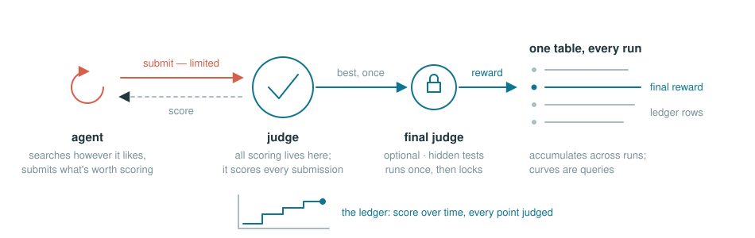
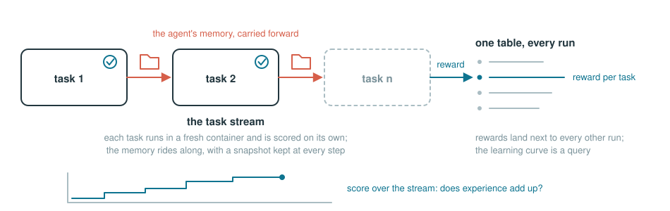

# 🌊 tide

[](https://github.com/Human-Agent-Society/tide-eval/actions/workflows/ci.yml)
[](pyproject.toml)
[](LICENSE)

**Evaluation infrastructure for self-evolving agents, on the [Harbor](https://github.com/laude-institute/harbor) task standard.**

An agent self-evolves when something it learned during a run persists
past it: memory, a skill library, an evolved harness, updated weights.
tide measures whether that state changes what the agent scores. It
supports two kinds of task.

**Autoresearch** is the kind of task that approaches such as DeepMind's
[AlphaEvolve](https://deepmind.google/discover/blog/alphaevolve-a-gemini-powered-coding-agent-for-designing-advanced-algorithms/)
and [Karpathy's autoresearch](https://github.com/karpathy/autoresearch) try to solve:
usually it comes with one open-ended problem measured by a continuous
score, hours of budget, and a judge that scores each submission. The
optimal score is unknown, so a result is the best score reached and how
long it took to get there (or how many evals):

<picture>
  <source media="(prefers-color-scheme: dark)" srcset="docs/assets/readme-hero-dark.svg">
  
</picture>

**A stream of tasks** runs one agent through an ordered
[stream](docs/get-started.md#streams) of tasks, and it measures whether
the agent keeps getting better and carries what it learns into the next
task (the setting used in [AgentStream](https://arxiv.org/abs/2608.00155)
and [CL-Bench](https://arxiv.org/pdf/2606.05661)):

<picture>
  <source media="(prefers-color-scheme: dark)" srcset="docs/assets/readme-stream-dark.svg">
  
</picture>

Tasks are written in the Harbor format. This infra supports evaluating
any agent that can work inside a container, and you can test your own
harness or method following
[running agents](docs/running-agents.md).

## Why not plain Harbor?

tide is built on Harbor. Harbor provides the runtime: the task format,
containers, agent adapters, the verifier, trajectories, `harbor job
resume`, and `harbor view`. tide builds on top of them and adds three features
specifically designed for evaluating agents that learn during the run.

| What tide adds | In code | Where |
|---|---|---|
| **A judge.** The agent can submit at any time, and the judge (instantiated in a separate container) scores and timestamps each submission. | `POST $JUDGE_URL/submit`<br>`-> {"score": 0.83, "best": 0.91, "remaining": 47}` | [`judge_server.py`](tasks/_template/environment/judge_server.py) |
| **Streams.** An ordered task list run and solved by one agent. tide snapshots the agent state after each episode and transfers it to the next. | `await Stream("wk1", tasks).run(lab, agent)` | [`stream.py`](tide/stream.py), [streams](docs/get-started.md#streams) |
| **One append-only table.** It stores every run, keyed by (task, agent, tags). tide provides various budget types for the agent runs, and provides common metrics for measuring self-evolving agents. | `metrics.auc(metrics.anytime(lab.df("trace")))` | [`store.py`](tide/store.py), [`budget.py`](tide/budget.py), [metrics](docs/metrics.md) |

Full design (how tide prevents reward hacking, task conventions, data
model, extensibility): **[docs/design.md](docs/design.md)**.

## Using tide

First run? **[docs/get-started.md](docs/get-started.md)** walks from
install to running and scoring a task.
**[docs/running-agents.md](docs/running-agents.md)** explains how to set
up a real agent, whether it is a common coding agent or your own. The
rest of the docs are outlined in **[docs/](docs/README.md)**. tide
provides both a CLI and a Python API, with example code for each below.

### Run

```bash
pip install "tide-eval[harbor]"    # or from a source checkout: pip install -e ".[harbor]"

tide list                          # what's runnable
tide fetch cl-bench                # download a benchmark's tasks (a source checkout has them all already)
tide run frontier-cs/frontier-cs-2-0-vllm-llm-serving-optimization --agent claude-code --model anthropic/claude-opus-5 --budget 2h
tide stream cl-bench --agent claude-code --model anthropic/claude-opus-5
```

`--budget` is time (`2h` / `30m` / `90s`; a bare number is hours); the other
budget axes are `--max-tokens` (e.g. `500k`) and `--max-evals`, which
needs a judge and so applies to autoresearch tasks. See
[budgets](docs/get-started.md#budgets).

#### No Docker? Develop locally, verify in containers

`--local` starts the task's own judge as a local process and runs your
command against it, with no containers involved:

```bash
tide run autoresearch/first-party/circle-packing --local \
  --command "python examples/random_search.py" --budget 30s
```

The judge code is the same, but nothing is isolated, so local rows are
never trusted results. Use local runs while developing and report the
numbers from container runs; the details are in
[get started](docs/get-started.md#no-docker-local-and-fake-runs).

With Docker, `tide run cl-bench/bsm-s01 --agent oracle` proves the real
pipeline end to end: the oracle runs the task's reference solution and
must score exactly 1.0.

### The Python API

A `Lab` is a directory. Each `run` call is one episode (one Harbor
trial), and `df` returns everything recorded so far as a pandas DataFrame:

```python
# Lab is asyncio-based: run this inside an async function or a notebook.
from tide import Lab, Budget, metrics

lab = Lab("runs/exp1")
row = await lab.run(
    "tasks/autoresearch/frontier-cs/frontier-cs-2-0-vllm-llm-serving-optimization",  # any task dir or Harbor registry id
    agent={"name": "claude-code", "model_name": "anthropic/claude-opus-5"},
    budget=Budget(
        time_h=2
    ),  # or max_tokens=500_000, max_submissions=50
    tags={"prompt": "v2"},  # free-form; each key becomes a df() column
)
row.rewards  # the judge's final verdict
row.uri  # the trial directory, for auditing

curve = metrics.anytime(lab.df("trace"))  # every submission's score, over time
metrics.auc(curve)  # the anytime score
```

Re-running any script resumes it. Reference:
[get started](docs/get-started.md) · [metrics](docs/metrics.md).

### Task streams

A `Stream` runs an ordered task list under one agent. Every task's
container mounts the same state directory (`$TIDE_STATE_DIR`), carrying
the agent's memory, skill library, or evolved harness from task to task:

```python
from tide import Lab, Stream, metrics

lab = Lab("runs/cl")
stream = Stream(
    "my-stream",  # the name; a new one reruns the same tasks from empty memory
    [  # ordered tasks, repeats allowed; repeating one measures forgetting
        "tasks/continual-learning/terminal-bench/chess-best-move",
        "tasks/continual-learning/terminal-bench/build-pmars",
        "tasks/continual-learning/terminal-bench/chess-best-move",
    ],
)
rows = await stream.run(
    lab,
    agent={"name": "claude-code", "model_name": "anthropic/claude-opus-5"},
    budget="30m",
)

df = lab.df("episode")
metrics.learning_curve(df, by=["stream"])  # reward by position in the stream
metrics.forgetting(df)  # the score change on the revisited task
metrics.transfer(df, baseline_df)  # against the same tasks run alone (plain lab.run)
```

Re-running the same stream resumes it. A stream's identity is its name plus
its agent, tags, budget, and task list; changing any of those makes a
separate stream with its own memory, and a new name reruns the same tasks
from empty memory. On the CLI that name is `--name`, defaulting to one
derived from the targets. Each task is an ordinary Harbor trial in its own
container, with memory snapshotted at every step, so a crashed stream
resumes where it left off. Full details:
**[docs/get-started.md](docs/get-started.md#streams)**.

### Evaluate your own agent

Every task gives your agent a `$JUDGE_URL` and a submission budget. Whichever
way you integrate, the task, judge, and results store are identical, so
numbers stay comparable across methods:

| You have | Integration |
|---|---|
| a mainstream harness (`claude-code`, `codex`, `aider`, …) | `--agent <name> --model <m>`, zero code |
| your own harness | one `BaseAgent` subclass, referenced via `import_path`; runnable template: [`examples/minimal_harness.py`](examples/minimal_harness.py) |
| OpenEvolve, Codex, or CORAL | version-pinned runnable adapters: [`examples/run_harness.py`](examples/run_harness.py) |
| another method that isn't an "agent" (evolutionary search, a solver) | POST candidates to `$JUDGE_URL/submit`, stop at 429 (about 20 lines) |

Scores always come from the task's judge. Full guide:
**[docs/running-agents.md](docs/running-agents.md)**.

### Examples

[`quickstart.py`](examples/quickstart.py) and
[`stream_quickstart.py`](examples/stream_quickstart.py) run with zero setup.
With Docker, [`minimal_harness.py`](examples/minimal_harness.py) is the
smallest real harness and [`llm_harness.py`](examples/llm_harness.py) is the
same thing with a model proposing the candidates;
[`examples/harnesses`](examples/harnesses) adds OpenEvolve, Codex, and CORAL
as baselines. What each shows: [`examples/`](examples/README.md).

## Benchmarks

### Autoresearch

| Benchmark | Tasks | Upstream | Run |
|---|---|---|---|
| [first-party](tasks/autoresearch/first-party) | 6 | this repo | `tide run autoresearch/first-party --agent <a>` |
| [EdgeBench](tasks/autoresearch/edgebench) | 51 · 2-12 h budgets | [ByteDance-Seed/EdgeBench](https://github.com/ByteDance-Seed/EdgeBench) | `tide run edgebench/<task> --budget <h>` |
| [FrontierCS](tasks/autoresearch/frontier-cs) | 208 · 188 algorithmic + 20 research, incl. 4 GPU kernel | [FrontierCS/Frontier-CS](https://github.com/FrontierCS/Frontier-CS) | `tide run frontier-cs/<task> --agent <a>` |

Each first-party task covers one hard part of the category (held-out
grading, safely grading agent-shipped code, ...); the
[catalog](tasks/README.md) lists every task with its oracle score. The
[roadmap](https://github.com/Human-Agent-Society/tide-eval/issues/19) tracks
the next converters.

### Task streams

Three stream benchmarks. terminal-bench and CL-Bench tasks are committed
to this repo (Apache-2.0) and run out of the box, with a pinned
`fetch.py` to regenerate them; SWE-bench Verified's dataset repo has no
license, so its tasks are fetched onto your machine instead:

| Benchmark | Tasks | Upstream | Run |
|---|---|---|---|
| [terminal-bench](tasks/continual-learning/terminal-bench) | 89 · **v2.0 only** (1.x unsupported) · committed | [terminal-bench-2](https://github.com/laude-institute/terminal-bench-2) (Apache-2.0) | `tide stream terminal-bench --agent <a>` |
| [SWE-bench Verified](tasks/continual-learning/swebench-verified) | 500 · fetched (upstream has no license) | [harbor-datasets](https://github.com/laude-institute/harbor-datasets) | `tide fetch swebench-verified --limit 50`, then `tide stream swebench-verified --agent <a>` |
| [CL-Bench](tasks/continual-learning/cl-bench) | 301 · **all 6 domains** · committed | [continual-learning-bench](https://github.com/pgasawa/continual-learning-bench) (Apache-2.0) | `tide stream cl-bench --agent <a>` |

Of the benchmarks [AgentStream](https://arxiv.org/abs/2608.00155) builds
its streams from, SWE-bench Verified is the hardest one with a published
Harbor version.
[CL-Bench](tasks/continual-learning/cl-bench) ([paper](https://arxiv.org/pdf/2606.05661)) is
a continual-learning benchmark in the strict sense: sequential instances
of one environment where remembering should help, scored by the upstream
metric in every domain (its *gain metric* is `metrics.transfer`). Where a
domain has hidden state (the poker deck, the metered database), that
state is kept in a judge sidecar the agent can only reach over HTTP. A
stream also takes any task list you build yourself, repeats allowed; see
[streams](docs/get-started.md#streams).

### Define a new task

```bash
mkdir -p tasks/autoresearch/my-suite     # a new benchmark is just a folder
cp -r tasks/_template tasks/autoresearch/my-suite/my-task
pytest tests/test_task_suite.py          # picked up automatically, and already green
```

The template ships as a complete working task: replace one `TODO(task)`
piece at a time and the suite keeps validating it. A benchmark is just a
directory of such tasks; `fetch.register(name, repo, ref)` makes a
git-hosted one downloadable by name, the way gym environments register.
Guide: **[docs/authoring-tasks.md](docs/authoring-tasks.md)**.

## Contributing

New tasks are the most welcome contribution; see
[define a new task](#define-a-new-task) above.

For benchmark converters, metrics, and runtime work,
[CONTRIBUTING.md](CONTRIBUTING.md) has the dev setup and the design rules
PRs are reviewed against.
