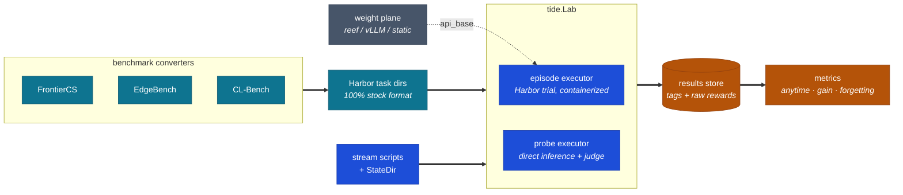
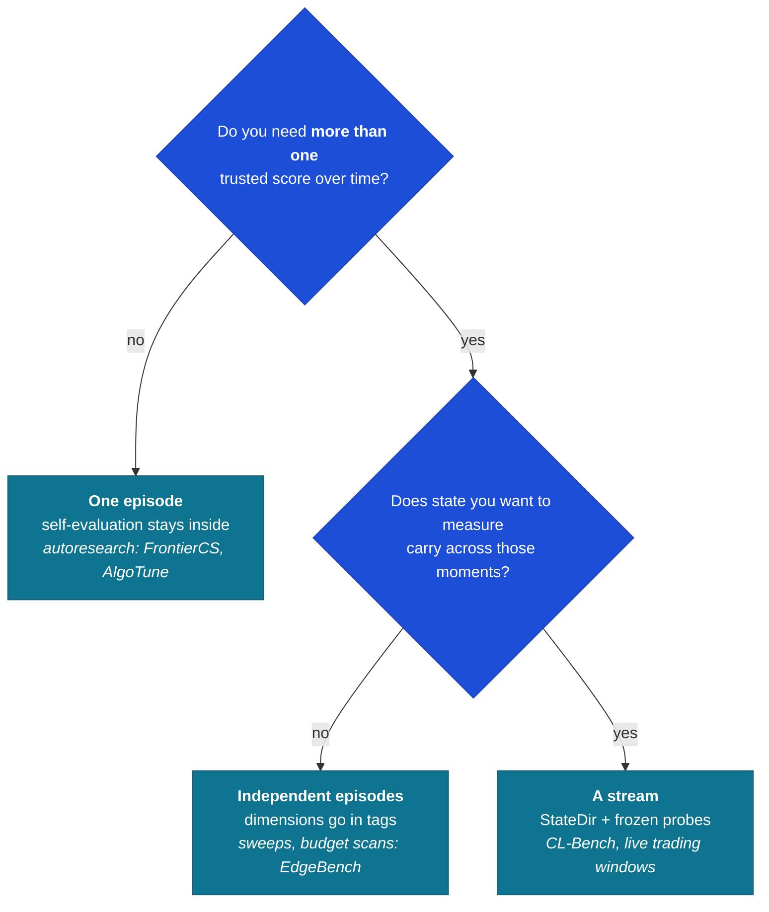
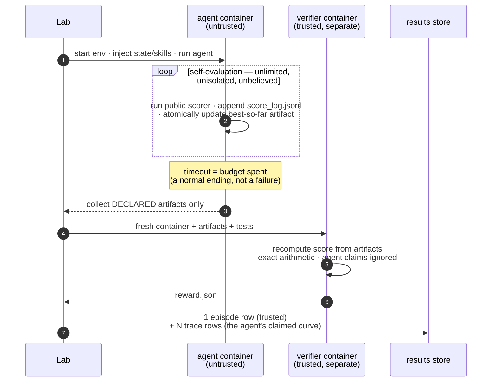
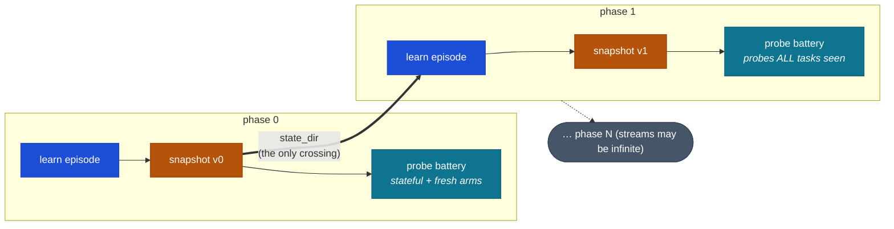
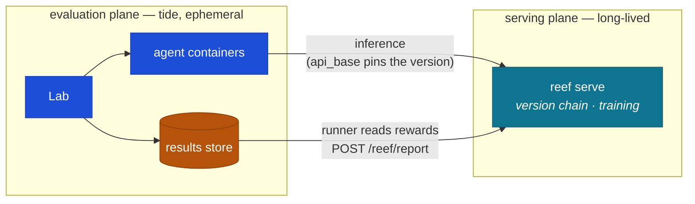

# 🌊 tide

[](https://github.com/Human-Agent-Society/tide-eval/actions/workflows/ci.yml)
[](pyproject.toml)
[](LICENSE)

**Continual evaluation infrastructure on the [Harbor](https://github.com/laude-institute/harbor) task standard.**

Harbor is very good at one thing: scoring an agent on one task, once, in a way
you can trust. tide is for everything that happens *after* that stops being
enough — agents that self-evaluate hundreds of times inside a single budget
(autoresearch), learners whose memory or weights evolve across an ordered
sequence of tasks (continual learning), and tasks that simply never end (live
trading, ops). All of it runs on Harbor tasks, unmodified.

## Two primitives

Every benchmark tide supports reduces to two ideas:

**An episode is one trusted measurement.** You give an agent a Harbor task, it
works, and a verifier produces a score you can trust. How often the agent
evaluated *itself* along the way doesn't matter — an episode boundary exists
wherever the *harness* needs a number it can rely on, and nowhere else.

**A stream is an ordered sequence of episodes with one crossing channel.**
Between episodes, exactly one thing survives: a state folder (or, for model
weights, a version reference). The folder is git-versioned, so you can always
see what the learner carried forward — and streams are allowed to be infinite.

Three more words appear throughout this README. Each has a precise meaning
and a concrete home in the codebase:

| Term | What it means in tide | Where it lives |
|---|---|---|
| **benchmark** | a set of tasks or probes plus the code that obtains them: either stock Harbor task dirs (from the registry or a **converter** script) or `Probe` objects (from a **loader** function) | loaders: [`tide/loaders.py`](tide/loaders.py) · authoring converters: [tasks.md](docs/components/tasks.md) · per-benchmark entry points: [the catalog below](#supported-benchmarks) |
| **protocol** | the schedule that decides what runs when — task orderings, feedback policy, probe sampling, control arms. Always a Python script calling `Lab`, never a config dialect | complete example: [`examples/stream_cl.py`](examples/stream_cl.py) · rules & rationale: [stream.md](docs/components/stream.md) |
| **metric** | a pure function `DataFrame → DataFrame` over the results store; each declares the tag columns it expects | implementations: [`tide/metrics.py`](tide/metrics.py) · catalog of all metrics: [metrics.md](docs/components/metrics.md) |



---

## Quick start

```bash
pip install tide-eval            # core: no containers, no heavy deps
pip install "tide-eval[harbor]"  # + the real Harbor executor (needs Docker)
```

The whole API is one class:

```python
from tide import Lab

lab = Lab("runs/exp1")  # a Lab is a directory

row = await lab.run(  # one episode = one trusted score
    task="terminal-bench/hello-world",  # any Harbor task dir or registry id
    agent={"name": "claude-code", "model_name": "anthropic/claude-opus-5"},
    tags={"attempt": 0},  # free-form labels, your dimensions
)
print(row.rewards)  # {'reward': 1.0}

df = lab.df()  # everything as pandas; metrics are queries
```

Three properties hold from day one:

1. **Re-running resumes.** Every episode has an idempotency key (auto-derived,
   or yours via `key=`). If a script crashes halfway, run it again — finished
   episodes are skipped, unfinished ones run. That is the entire resume story.
2. **Tags are the schema.** There is no fixed result format. A forgetting
   matrix and a budget-scaling curve are both pivots over `lab.df()`.
3. **Every number is auditable.** Each row's `uri` points back to the Harbor
   trial directory that produced it, with full logs and artifacts.

Try it without Docker (fake executor, 30 seconds), then for real:

```bash
python examples/quickstart.py           # the API shape, offline
python examples/stream_cl.py            # a full continual-learning stream, offline
python examples/run_circle_packing.py   # the real thing (Docker): oracle proves the pipeline
```

---

## Episode or stream?



The test is always the same question: *where does the harness need a score it
can trust?* Each such moment is an episode boundary. An autoresearch agent
scoring itself a thousand times creates zero boundaries — those numbers are
advisory. A trading account you settle every Friday creates one boundary per
week, forever.

---

## How an episode runs

The design splits evaluation into an untrusted inner world and a trusted
outer one. Inside its container, the agent can self-evaluate freely — and
tamper with anything it likes, because nothing in there is believed. The
trusted score is computed afterwards, in a fresh container that receives only
the artifact files the task declared.



Being killed at the deadline is fine: the task convention requires the agent
to keep its best solution written to a fixed path at all times, so the
verifier grades whatever the budget bought. The cheat-proofing is tested —
`tests/test_exemplar_grader.py` feeds the grader overlapping circles,
float-epsilon violations, and forged score claims, and expects zero for each.

---

## How a stream runs

A stream script is a plain Python loop. tide supplies the state machinery;
the protocol — what to ingest, when to probe, what feedback the learner gets —
stays in your script, where variation is cheap.



```python
state = StateDir("runs/exp/state")
for i, doc in enumerate(corpus):
    ingest(state.path, doc)  # your learner, your rules
    ref = state.snapshot(f"phase {i}")  # frozen, diffable, replayable
    frozen = state.materialize(ref)  # probes never touch live state
    for j in sample(range(i + 1)):
        await lab.probe(
            probes[j], model_with(frozen), tags={"phase": i, "arm": "stateful"}
        )
        await lab.probe(
            probes[j], model_with(None), tags={"phase": i, "arm": "fresh"}
        )  # control arm
```

The two arms are what make the measurement honest. "Stateful minus fresh" is
CL-Bench's gain metric — how much of the score is *learning* rather than raw
model capability — and here it costs two rows and one query
(`metrics.gain`). Forgetting and transfer come from the same table
(`metrics.matrix`, `metrics.forgetting`). Probes are direct inference plus a
rubric judge, no container, so probing densely at every phase costs API
calls, not machine time.

---

## If you already know Harbor

tide imports Harbor as a library and never touches its CLI. We deliberately
did not fork: a fork loses the upstream task ecosystem and its fixes, while a
library keeps both and adds a layer Harbor doesn't have. Tasks remain 100%
stock Harbor tasks — every task in this repo runs standalone under
`harbor trial start`, and the ~80 registry datasets work here unchanged.
(That promise is enforced by a test.)

| Harbor gives | tide adds |
|---|---|
| Task format, env backends, verifier isolation, regrade, oracle/nop agents | used as-is, pinned |
| `Trial.create/run` for one trial | `Lab`: idempotent keys, bounded concurrency, an append-only **tagged results store** that accretes across scripts and weeks |
| One trusted score per trial | **score trajectories** — the agent's self-reported curve (`score_log.jsonl`), ingested as queryable `trace` rows next to the trusted score |
| pass@k within a job | **cross-run metrics**: anytime/AUC, budget scaling, gain, forgetting, internalization |
| stateless trials, by design | **streams**: a git-versioned `StateDir` as the single cross-episode channel, frozen probes, fresh-control arms |
| container-scored tasks | a **probe executor** (inference + rubric judge, no container) for dense capability tracking |
| — | **`WeightPlane`** — a two-method, vendor-neutral contract for learners whose state is model weights |

If you take away four ideas, take these: episode boundaries sit where the
harness needs trust, not where the agent stops working; state crosses
episodes through exactly one audited channel; self-evaluation is free
*because* it is untrusted, while trusted scores are walled off; and every
metric is a query over one table, not a pipeline.

---

## Components

One surface is frozen — `Lab.run`'s signature and the store schema (columns
may be added, never changed). Five small modules sit around it, each with a
doc that says how to modify it and which invariants your change must not
break:

| Component | Code | What it does | Change it when you need… | Doc |
|---|---|---|---|---|
| **Lab & store** | `tide/lab.py` · `tide/store.py` | episodes/probes in, DataFrame out | new row kinds, key semantics | [lab.md](docs/components/lab.md) |
| **Executors** | `tide/executors.py` | `EpisodeSpec → EpisodeResult` | a new backend (SSH, cloud, simulator) | [executors.md](docs/components/executors.md) |
| **Probes** | `tide/probe.py` | inference + rubric judging | a different judge or aggregation | [probe.md](docs/components/probe.md) |
| **Stream tooling** | `tide/stream.py` | `StateDir`, `WeightPlane` | a new state channel or serving stack | [stream.md](docs/components/stream.md) |
| **Metrics** | `tide/metrics.py` | pure DataFrame functions | a new metric (add one function) | [metrics.md](docs/components/metrics.md) |
| **Tasks** | `examples/tasks/` | Harbor tasks + tide conventions | to author tasks or benchmarks | [tasks.md](docs/components/tasks.md) |

Four dependency rules keep it decoupled, and violating any of them is a
design bug: converters see only the task format, never tide internals; the
core does not know streams exist (stream scripts are pure callers of `Lab`);
metrics import pandas and nothing from tide; the store holds raw scores and
all normalization happens at query time.

---

## Supported benchmarks

Every row says exactly what exists *in tide* to run it. The statuses are
honest: ✅ one call runs it today · 🔧 the pattern is implemented in-repo,
light assembly required · 🗺️ the mapping is documented but **no code exists
in tide yet** (tracked in the [roadmap](#roadmap)).

**Episodic / agentic** — the Harbor ecosystem, unchanged:

| Benchmark | What it tests | Status | Run it in tide with |
|---|---|---|---|
| [terminal-bench 2](https://github.com/laude-institute/terminal-bench) | agentic terminal tasks | ✅ | `lab.run("terminal-bench/hello-world", agent)` — Harbor downloads the task by id |
| [SWE-bench family + ~80 registry datasets](https://github.com/laude-institute/harbor/tree/main/adapters) | software engineering, QA, reasoning | ✅ | same: any Harbor registry id (`"swebench-verified/..."`, `"algotune/..."`, …) |

**Autoresearch** — open-ended tasks, continuous scores, budgets:

| Benchmark | What it tests | Status | Run it in tide with |
|---|---|---|---|
| `circle-packing-mini` (in-repo exemplar) | dual scorer, anti-hack wall, budget semantics, score trajectory — the reference for the whole category | 🔧 | `python examples/run_circle_packing.py` (Docker) |
| [AlgoTune](https://github.com/oripress/AlgoTune) · 154 tasks | speed up code vs a reference | ✅ | `lab.run("algotune/<task>", agent)` via its [Harbor adapter](https://github.com/laude-institute/harbor/tree/main/adapters/algotune) |
| [FrontierCS](https://github.com/FrontierCS/Frontier-CS) · 240 open problems (Erdős constructions, BBOPlace) | open-ended CS with expert evaluators | 🔧 | generate task dirs with their repo's Harbor export, then `lab.run(<dir>, agent)` — no tide-side code needed, but the export step is theirs |
| [EdgeBench](https://github.com/ByteDance-Seed/EdgeBench) · 51 tasks, 2–12 h budgets | capability vs interaction time | 🗺️ | nothing yet — a spec→task converter is roadmap; its two-container judging maps to Harbor's separate verifier and its score rescales already exist as `metrics.rescale_anchored` |

**Continual learning / streams**:

| Benchmark | What it tests | Status | Run it in tide with |
|---|---|---|---|
| [CL-bench / CL-bench Life (Tencent)](https://github.com/Tencent-Hunyuan/CL-bench) · 1,899 + 405 rubric-judged tasks | ingest-then-probe conversion: context moves into learner state, probes run without it | ✅ | `loaders.load_rubric_probes("CL-bench.jsonl")` → probes; `loaders.strip_context(p)` makes the from-state arm; judge with `openai_rubric_judge`. Data from [HuggingFace](https://huggingface.co/datasets/tencent/CL-bench) |
| [CL-Bench (Anthropic)](https://arxiv.org/abs/2606.05661) · 6 domains with shared latent structure | does experience improve performance? | 🔧 | the protocol shape is [examples/stream_cl.py](examples/stream_cl.py) and the gain metric is `metrics.gain`; their tasks themselves are not yet packaged as Harbor dirs |
| [AgentStream](https://arxiv.org/abs/2608.00155) | any static benchmark, streamed by progressive reveal | 🗺️ | nothing yet — a reveal-policy converter is roadmap |
| [SkillLearnBench](https://github.com/cxcscmu/SkillLearnBench) | continual skill generation | 🗺️ | nothing yet — maps onto the skills-channel `StateDir` |

**Live / infinite-horizon**:

| Pattern | What it tests | Status | Run it in tide with |
|---|---|---|---|
| Market trading (Kalshi-style) | unbounded stream of settlement windows; verifier observes the exchange's ledger; nop = hold ⇒ score − nop = alpha | 🗺️ | nothing yet — the full task design is written in [tasks.md](docs/components/tasks.md#live-tasks) |

---

## Authoring your own

The five-minute version — the full guide is
[docs/components/tasks.md](docs/components/tasks.md):

- **A plain task** is a Harbor task
  (`task.toml · instruction.md · environment/ · tests/ · solution/`).
  Verify it standalone with `harbor trial start -p <dir>`; then it's an
  episode.
- **An autoresearch task** adds four conventions, all visible in
  [circle-packing-mini](examples/tasks/circle-packing-mini): a public scorer
  baked into the image; `environment_mode = "separate"` plus declared
  artifacts (the wall); atomic best-so-far writes so timeout = budget; and a
  `score_log.jsonl` the agent appends to.
- **A benchmark converter** is a script that emits task folders. It depends
  only on the task format, so it cannot break anything.
- **A stream protocol** is a Python loop over `lab.run`/`lab.probe` — see
  [examples/stream_cl.py](examples/stream_cl.py) for a complete one.

Keep three agents in rotation while developing any task: **oracle** (runs
`solution/`, proves the pipeline), **nop** (does nothing, catches leakage),
and a **cheater** (tampers with scorers, must not move the trusted score).

---

## Plugging in a learning stack (reef, vLLM, yours)

tide has zero reef dependency. When the evolving state is model weights, the
entire contract between tide and any serving/training stack is two methods:

```python
class WeightPlane(Protocol):
    def snapshot(self) -> str: ...  # freeze current weights → version ref
    def serve(self, ref: str) -> str: ...  # any historical ref → OpenAI-compatible URL
```

[reef](https://github.com/Human-Agent-Society/reef) implements this naturally
(version chains, CAS publishing, per-request attribution). So does vLLM with
a checkpoint directory. A model that never learns implements it in three
lines (`StaticWeightPlane`) — and doubles as the fresh-control arm.



One lap of the loop
(full file: [examples/reef_weightplane.py](examples/reef_weightplane.py)):

```python
ref = plane.snapshot()  # freeze current weights
row = await lab.run(
    task,
    {
        "name": "terminus-2",  # host-side brain: the container stays offline
        "kwargs": {"api_base": plane.serve(ref)},  # version-pinned inference
    },
    tags={"version": ref},
)
report(score=row.rewards["reward"], references=[ref])  # reef trains; next lap, new ref
```

Rewards accumulate as `(version, task, reward)` rows; learning curves, gain
against a static control, and forgetting matrices are queries from then on.
One discipline: a probe battery always pins the `ref` it started with, so
asynchronous training can never dirty a measurement mid-battery.

---

## Design rules

1. **One frozen surface.** `Lab.run`'s signature and the store schema.
   Everything else stays cheap to revisit.
2. **Tasks stay stock Harbor.** Streams are manifests around tasks, never a
   dialect inside them.
3. **Trust is walled, never assumed.** Self-evaluation is free because it is
   untrusted; trusted scores come only from separate verifiers or external
   ground truth.
4. **One audited crossing channel.** State moves between episodes as a
   git-versioned folder or a version ref — environments are always
   disposable.
5. **Persistence lives in data, not processes.** No daemon. Idempotent keys
   make any crashed script resumable.
6. **Abstractions are earned.** A helper enters the library when it has
   repeated in at least two real scripts, not before.

## Roadmap

Where this sits today, honestly: the core is small, tested (43 tests, CI),
and the patterns are proven offline. The distance to a mature ecosystem is
mostly breadth, and it's tracked here:

- [ ] **Docker end-to-end in CI** — the oracle run of circle-packing-mini as
  a gated workflow (needs Docker-capable runners)
- [ ] **EdgeBench converter** — spec → task dirs; the mapping is documented
- [ ] **AgentStream converter** — reveal policies over registry datasets
- [x] **Tencent CL-bench loader** — `loaders.load_rubric_probes` +
  `strip_context` (shipped)
- [ ] **SkillLearnBench + Anthropic CL-Bench task packaging** — their tasks
  as Harbor dirs plus stream manifests
- [ ] **Harbor pin upgrades** — golden-file workflow for bumping the pinned
  version safely
- [ ] **PyPI release** — publish `tide-eval` (the name is reserved in
  pyproject; not yet released)
- [ ] **A hosted results viewer** — `lab.df()` is enough for research use;
  a shared leaderboard view is not built

## Development

```bash
git clone https://github.com/Human-Agent-Society/tide-eval && cd tide-eval
uv venv --python 3.12 && uv pip install -e . pytest pytest-asyncio ruff
.venv/bin/python -m pytest tests/ -q     # 43 tests; harbor tests skip if absent
uv pip install -e path/to/harbor         # optional: enables the integration tests
.venv/bin/ruff check . && .venv/bin/ruff format --check .
```

Contributions welcome — see [CONTRIBUTING.md](CONTRIBUTING.md) for the design
rules PRs are reviewed against. Licensed [Apache-2.0](LICENSE).
