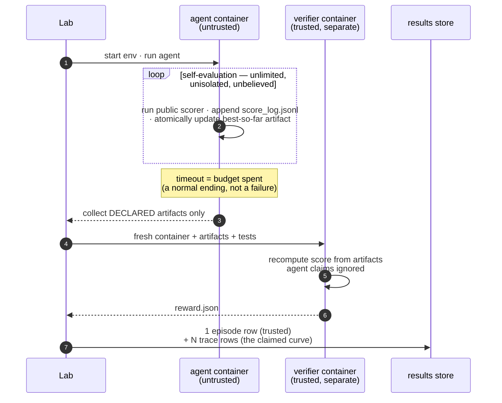

# 🌊 tide

[](https://github.com/Human-Agent-Society/tide-eval/actions/workflows/ci.yml)
[](pyproject.toml)
[](LICENSE)

**Autoresearch evaluation infrastructure on the [Harbor](https://github.com/laude-institute/harbor) task standard.**

Autoresearch tasks are open-ended optimization problems with an hours-long
budget and a *continuous* score: pack circles tighter, make this kernel
faster, compress this string further. There is no "passed" — only *how
good, by when*. Evaluating that regime honestly needs machinery a
pass/fail harness doesn't have, and tide provides exactly that machinery:

- **a trusted score per episode** — recomputed by a verifier in a separate
  container from declared artifacts only; agent claims are ignored, and the
  cheat-proofing is itself tested in CI;
- **the self-eval trajectory as data** — every score the agent claimed
  along the way, stored as untrusted `trace` rows next to the trusted one;
- **budget semantics** — timeout is a normal ending: the verifier grades
  the best-so-far artifact the budget bought;
- **resumable sweeps** — idempotency keys mean a crashed sweep re-run
  skips finished episodes; no daemon, no job state;
- **metrics as queries** — anytime curve, AUC, budget scaling: pandas
  functions over one results table, with full provenance (`uri` → the
  Harbor trial directory behind every number).

Tasks are 100% stock Harbor tasks (enforced by test). Agents are anything
that can work inside a container — including your own harness or a method
that isn't an "agent" at all.

**How it works, in one picture** — the agent's world is untrusted by
design; the score is computed behind a wall:



The full design — trust model, the four task conventions, the data model,
extensibility — is in **[docs/design.md](docs/design.md)**.

## Install & run

```bash
pip install tide-eval            # core: no containers, no heavy deps
pip install "tide-eval[harbor]"  # + the real Harbor executor (needs Docker)
```

```bash
tide list                                                    # what's runnable
tide run autoresearch --agent oracle                         # all 6 first-party tasks (Docker)
tide run tasks/autoresearch/tsp-tour --agent claude-code --model anthropic/claude-opus-5
tide run edgebench/ann_vector_search_qps --agent codex --budget 2     # budget in hours
tide run algotune/psd_cone_projection --agent claude-code --model ... # Harbor registry id
tide report                                                  # summarize the store
tide run autoresearch --agent oracle --fake                  # no Docker: offline smoke
```

No Docker yet? `python examples/quickstart.py` shows the full API shape
offline in 30 seconds; `python examples/run_circle_packing.py` then proves
the real pipeline (the oracle must score exactly 0.75).

## Use the API

The CLI is a thin caller of one class. A `Lab` is a directory; `run` is
one episode; `df` is the whole export story:

```python
from tide import Lab, metrics

lab = Lab("runs/exp1")

row = await lab.run(
    "tasks/autoresearch/circle-packing",  # any Harbor task dir or registry id
    agent={"name": "claude-code", "model_name": "anthropic/claude-opus-5"},
    tags={"budget": 2, "attempt": 0},  # free-form tags = your schema
)
row.rewards  # {'reward': ...}  — trusted
row.uri  # the auditable trial directory

ep = lab.df("episode")  # trusted scores, one row each
curve = metrics.anytime(lab.df("trace"))  # the agent's claimed progress
metrics.auc(curve)  # the anytime score
metrics.scaling(ep, by=["model"])  # what does more budget buy?
```

Re-running any script resumes it: finished episodes are skipped by
idempotency key. Details and invariants:
[docs/components/lab.md](docs/components/lab.md) ·
[metrics.md](docs/components/metrics.md) ·
[executors.md](docs/components/executors.md).

## Evaluate *your* agent

Three integration levels — same tasks, same wall, same store, so numbers
stay comparable across methods:

| Level | You have | Integration |
|---|---|---|
| 1 | a mainstream harness (`claude-code`, `codex`, `aider`, `cursor-cli`, `terminus-2`, …) | `--agent <name> --model <m>` — zero code |
| 2 | your own harness (own loop, tools, orchestration) | one `BaseAgent` subclass, referenced via `import_path` |
| 3 | a method that isn't an "agent" (OpenEvolve-style evolutionary search, a solver, a sampling loop) | satisfy the task contract: keep your best solution at the declared artifact path, optionally append self-scores to `score_log.jsonl` |

The container-side contract is identical across all six first-party tasks
(one scorer path, one artifact path), so one integration covers the whole
suite. The one thing you cannot bring is your own grader — trusted scores
come from the task's verifier or they don't exist. Full guide with the
`BaseAgent` skeleton, the contract table, and a **worked OpenEvolve
example**: **[docs/integration.md](docs/integration.md)**.

## Define a new task

```bash
cp -r tasks/_template tasks/autoresearch/my-task
```

Work through the `TODO(task)` markers (six files: config, instruction,
public scorer, trusted grader, cheat vectors, oracle solution), then run
`pytest tests/test_task_suite.py` — your task is picked up automatically:
oracle score, cheat suite, stock-Harbor validation, zero test code to
write. GPU tasks (kernels, CUDA) add two lines of configuration — see the
guide. Full authoring reference:
**[docs/components/tasks.md](docs/components/tasks.md)** ·
template walkthrough: [`tasks/_template`](tasks/_template).

## The task catalog

Browsable at [`tasks/`](tasks/) — every task also runs standalone under
`harbor trial start` (enforced by test):

| Benchmark | Tasks | What it tests | Run |
|---|---|---|---|
| [first-party](tasks/autoresearch) | 6 | the full protocol — each task teaches one hard part of the category | `tide run autoresearch --agent <a>` |
| [EdgeBench](tasks/edgebench) | 51 · 2–12 h | capability vs interaction time | `tide run edgebench/<task> --budget <h>` (needs their prebuilt images) |
| [FrontierCS 2.0](tasks/frontier-cs) | 20 · incl. 4 GPU kernel | open-ended CS problems, expert evaluators | `python examples/run_frontiercs.py` |
| [AlgoTune](https://github.com/oripress/AlgoTune) | 154 | speed up code vs a reference | `tide run algotune/<task> --agent <a>` (Harbor registry) |

The six first-party tasks, individually — oracle-verified in real
containers and cheat-vector-tested on every CI run:

| Task | One line | Teaches |
|---|---|---|
| [`circle-packing`](tasks/autoresearch/circle-packing) | pack 3 circles, maximize Σ radii | the full protocol; exact-arithmetic grading |
| [`function-minimization`](tasks/autoresearch/function-minimization) | minimize deceptive Levi N.13 | exploration vs local search |
| [`tsp-tour`](tasks/autoresearch/tsp-tour) | shorten a 40-city tour | combinatorial search, continuous signal |
| [`bin-packing`](tasks/autoresearch/bin-packing) | beat first-fit on 60 items | exact constraint checking |
| [`symbolic-regression`](tasks/autoresearch/symbolic-regression) | recover a hidden formula | the anti-overfitting wall: graded on held-out points |
| [`string-compression`](tasks/autoresearch/string-compression) | ship decompressor + payload | safely grading agent-shipped code |

## Project layout

| | Code | Doc |
|---|---|---|
| Design & trust model | — | [docs/design.md](docs/design.md) |
| Agent/harness integration | — | [docs/integration.md](docs/integration.md) |
| Lab & results store | [`tide/lab.py`](tide/lab.py) · [`tide/store.py`](tide/store.py) | [components/lab.md](docs/components/lab.md) |
| Executors (Harbor, fake) | [`tide/executors.py`](tide/executors.py) | [components/executors.md](docs/components/executors.md) |
| Score-trajectory ingestion | [`tide/trajectory.py`](tide/trajectory.py) | (docstring) |
| Metrics | [`tide/metrics.py`](tide/metrics.py) | [components/metrics.md](docs/components/metrics.md) |
| Task authoring & GPU guide | [`tasks/_template`](tasks/_template) | [components/tasks.md](docs/components/tasks.md) |
| Contributing & design rules | — | [CONTRIBUTING.md](CONTRIBUTING.md) |

The frozen surface is `Lab.run`'s signature and the store schema;
everything else is small modules with documented invariants. Future
regimes (continual-learning streams, live infinite-horizon tasks) are
designed to land as extensions — new row kinds, new executors, new metric
functions — not rewrites; see the
[extensibility section](docs/design.md#extensibility).

## Roadmap

- [ ] **PyPI release** — publish `tide-eval` (name reserved; not yet released)
- [ ] **A GPU exemplar task in CI** — first-party kernel task, oracle-gated
  on a GPU runner
- [ ] **Harbor pin upgrades** — golden-file workflow for bumping the pin safely
- [ ] **More converters** — the autoresearch ecosystem is bigger than our catalog
- [ ] **A hosted results viewer** — `lab.df()` is enough for research use;
  a shared leaderboard is not built
- [ ] **Beyond autoresearch** — continual-learning streams and live tasks,
  as extensions, when this regime is served extremely well

## Development

```bash
git clone https://github.com/Human-Agent-Society/tide-eval && cd tide-eval
uv venv --python 3.12 && uv pip install -e . pytest pytest-asyncio ruff
.venv/bin/python -m pytest tests/ -q     # harbor tests skip if absent
uv pip install -e path/to/harbor         # optional: enables the integration tests
.venv/bin/ruff check . && .venv/bin/ruff format --check .
```

Contributions are reviewed against the design rules in
[CONTRIBUTING.md](CONTRIBUTING.md). Licensed [Apache-2.0](LICENSE).
