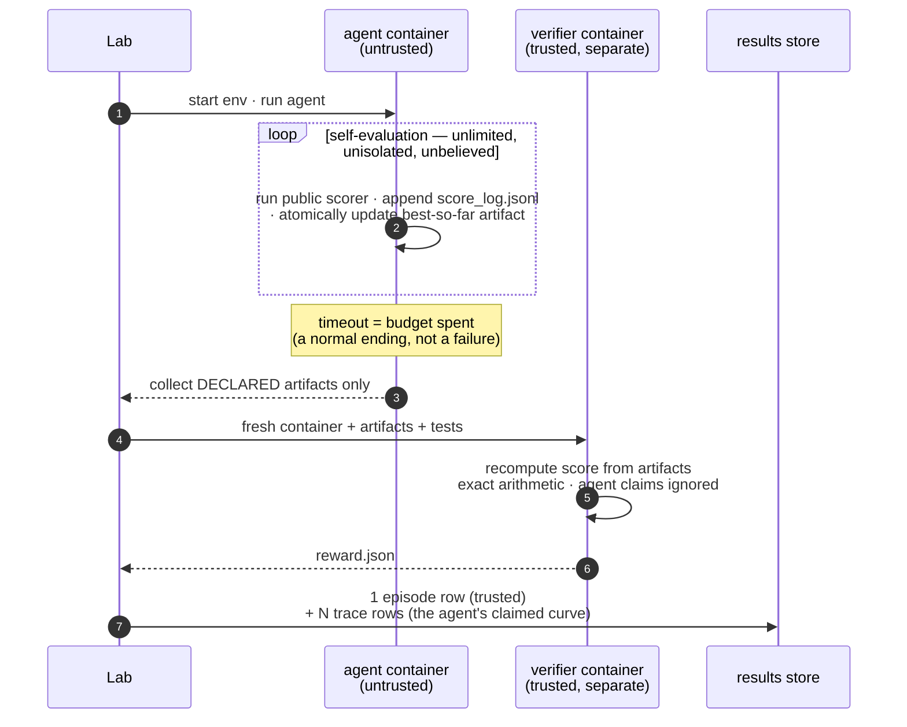

# 🌊 tide

[](https://github.com/Human-Agent-Society/tide-eval/actions/workflows/ci.yml)
[](pyproject.toml)
[](LICENSE)

**Autoresearch evaluation infrastructure on the [Harbor](https://github.com/laude-institute/harbor) task standard.**

Harbor is very good at one thing: scoring an agent on one task, once, in a
way you can trust. **Autoresearch** breaks that mold: the agent gets an
open-ended optimization problem and an hours-long budget, evaluates itself
hundreds of times, and produces a *continuous* score — not pass/fail. To
evaluate that, you need everything around the single trusted score: the
agent's self-eval trajectory, budget-scaling curves, tamper-proof grading,
and sweeps that survive crashes. That is tide. All of it runs on stock
Harbor tasks, unmodified.

## Two ideas

**An episode is one trusted measurement.** You give an agent a Harbor task,
it works until the budget runs out, and an isolated verifier produces a
score you can trust. How often the agent evaluated *itself* along the way
doesn't matter — those numbers are recorded, but never believed.

**Everything else is tags and queries.** There is no fixed result schema:
budgets, attempts, models, and suites are free-form tags on an append-only
store, and every metric — anytime score, AUC, budget scaling — is a pandas
query over one table.

## What tide adds on top of Harbor

| | Harbor | tide |
|---|---|---|
| One trusted score per task | ✅ | + untrusted **score trajectories** (the agent's self-eval curve, queryable) |
| Programmatic trials | per trial | **`Lab`**: idempotent keys (crash = resume), tagged append-only store accreting for weeks |
| Batch stats (pass@k) | job-scoped | **cross-run metrics**: anytime/AUC, budget scaling — all queries |
| Container-scored tasks | ✅ | **budget semantics**: timeout = budget spent, a normal ending that still grades |
| — | — | **task catalog**: 77 runnable tasks in-repo + one-command CLI (`tide run`) |

## Quick start

```bash
pip install tide-eval            # core: no containers, no heavy deps
pip install "tide-eval[harbor]"  # + the real Harbor executor (needs Docker)
```

One command runs anything — a task, a whole category, or a Harbor registry id:

```bash
tide list                                                    # what's runnable
tide run autoresearch --agent oracle                         # all 6 first-party tasks (Docker)
tide run tasks/autoresearch/tsp-tour --agent claude-code --model anthropic/claude-opus-5
tide run terminal-bench/hello-world --agent claude-code --model ...   # registry id
tide run edgebench/ann_vector_search_qps --agent codex --budget 2     # budget in hours
tide report                                                  # summarize the store
tide run autoresearch --agent oracle --fake                  # no Docker: offline smoke
```

Every run lands in the same tagged, idempotent results store — re-running a
crashed sweep resumes it, and `tide report` is a query, not a pipeline.

For protocols the CLI can't express (custom schedules, control arms), the
same store is one class away:

```python
from tide import Lab

lab = Lab("runs/exp1")  # a Lab is a directory

row = await lab.run(  # one episode = one trusted score
    task="tasks/autoresearch/circle-packing",  # any Harbor task dir or registry id
    agent={"name": "claude-code", "model_name": "anthropic/claude-opus-5"},
    tags={"budget": 2, "attempt": 0},  # free-form labels, your dimensions
)
print(row.rewards)  # {'reward': 0.83}

df = lab.df()  # everything as pandas; metrics are queries
```

Three properties hold from day one:

1. **Re-running resumes.** Every episode has an idempotency key (auto-derived,
   or yours via `key=`). If a script crashes halfway, run it again — finished
   episodes are skipped, unfinished ones run. That is the entire resume story.
2. **Tags are the schema.** There is no fixed result format. A budget-scaling
   curve and a model comparison are both pivots over `lab.df()`.
3. **Every number is auditable.** Each row's `uri` points back to the Harbor
   trial directory that produced it, with full logs and artifacts.

Try it without Docker (fake executor, 30 seconds), then for real:

```bash
python examples/quickstart.py           # the API shape, offline
python examples/run_circle_packing.py   # the real thing (Docker): oracle proves the pipeline
```

---

## How an episode runs

The design splits evaluation into an untrusted inner world and a trusted
outer one. Inside its container, the agent can self-evaluate freely — and
tamper with anything it likes, because nothing in there is believed. The
trusted score is computed afterwards, in a fresh container that receives only
the artifact files the task declared.



Being killed at the deadline is fine: the task convention requires the agent
to keep its best solution written to a fixed path at all times, so the
verifier grades whatever the budget bought. The cheat-proofing is tested —
`tests/test_task_suite.py` feeds every grader its task's cheat vectors
(overlapping circles, float-epsilon violations, forged score claims) and
expects zero for each.

The four task conventions behind this — public scorer in the image, the
declared-artifacts wall, atomic best-so-far writes, `score_log.jsonl` — are
specified in [docs/components/tasks.md](docs/components/tasks.md), with
[`tasks/autoresearch/circle-packing`](tasks/autoresearch/circle-packing) as
the reference implementation.

---

## GPU tasks (kernels, CUDA, ML workloads)

Kernel-optimization and other GPU-bound tasks are plain Harbor tasks with two
extra lines of configuration. tide adds no machinery — the point is that it
doesn't need to:

1. **Declare the requirement** in `task.toml` — validated by Harbor's schema,
   honored natively by Harbor's cloud backends (Modal, Beam, GKE, SkyPilot,
   Daytona, …):

   ```toml
   [environment]
   gpus = 1
   ```

2. **On local Docker**, Harbor merges a task-authored
   `environment/docker-compose.yaml` over its generated one, so GPU access is
   a standard compose device reservation on the `main` service (requires the
   NVIDIA Container Toolkit):

   ```yaml
   services:
     main:
       deploy:
         resources:
           reservations:
             devices:
               - driver: nvidia
                 count: all
                 capabilities: [gpu]
   ```

The same compose-overlay mechanism covers judge sidecars — see the vendored
[FrontierCS GPU kernel tasks](tasks/frontier-cs) (kmeans / knn / ivf-pq /
dbscan), which ship a separate judge container wired exactly this way.
Because tasks stay stock Harbor, a GPU task runs identically under
`harbor trial start`, `tide run`, and any cloud backend.

---

## If you already know Harbor

tide imports Harbor as a library and never touches its CLI. We deliberately
did not fork: a fork loses the upstream task ecosystem and its fixes, while a
library keeps both and adds a layer Harbor doesn't have. Tasks remain 100%
stock Harbor tasks — every task in this repo runs standalone under
`harbor trial start`, and the ~80 registry datasets work here unchanged.
(That promise is enforced by a test.)

| Harbor gives | tide adds |
|---|---|
| Task format, env backends, verifier isolation, regrade, oracle/nop agents | used as-is, pinned |
| `Trial.create/run` for one trial | `Lab`: idempotent keys, bounded concurrency, an append-only **tagged results store** that accretes across scripts and weeks |
| One trusted score per trial | **score trajectories** — the agent's self-reported curve (`score_log.jsonl`), ingested as queryable `trace` rows next to the trusted score |
| pass@k within a job | **cross-run metrics**: anytime/AUC, budget scaling |

If you take away three ideas, take these: the trusted score sits at the
episode boundary, not where the agent stops working; self-evaluation is free
*because* it is untrusted, while trusted scores are walled off; and every
metric is a query over one table, not a pipeline.

---

## Components

One surface is frozen — `Lab.run`'s signature and the store schema (columns
may be added, never changed). Small modules sit around it, each with a doc
that says how to modify it and which invariants your change must not break:

| Component | Code | What it does | Change it when you need… | Doc |
|---|---|---|---|---|
| **CLI** | `tide/cli.py` | `tide run/list/report/fetch` — the one-command surface; a thin caller of `Lab` | new commands, target resolution | `tide --help` |
| **Lab & store** | `tide/lab.py` · `tide/store.py` | episodes in, DataFrame out | new row kinds, key semantics | [lab.md](docs/components/lab.md) |
| **Executors** | `tide/executors.py` | `EpisodeSpec → EpisodeResult` | a new backend (SSH, cloud, simulator) | [executors.md](docs/components/executors.md) |
| **Trajectory** | `tide/trajectory.py` | `score_log.jsonl` → trace rows | a different score-log convention | (docstring) |
| **Metrics** | `tide/metrics.py` | pure DataFrame functions | a new metric (add one function) | [metrics.md](docs/components/metrics.md) |
| **Tasks** | `tasks/` | the benchmark catalog: vendored + fetchable Harbor tasks | to author tasks or benchmarks | [tasks/README.md](tasks/README.md) · [tasks.md](docs/components/tasks.md) |

Three dependency rules keep it decoupled, and violating any of them is a
design bug: converters see only the task format, never tide internals;
metrics import pandas and nothing from tide; the store holds raw scores and
all normalization happens at query time.

---

## Supported benchmarks

**The browsable catalog is [`tasks/`](tasks/)** — one folder per benchmark:
six first-party autoresearch tasks ship in-repo (oracle-verified in real
containers by CI), external benchmarks come with vendored tasks plus a
`fetch.py`, and [`tasks/_template/`](tasks/_template) turns making your own
into a five-minute copy-paste.

**Autoresearch** — open-ended tasks, continuous scores, budgets:

| Benchmark | What it tests | Run it in tide with |
|---|---|---|
| [`tasks/autoresearch/`](tasks/autoresearch) · 6 first-party tasks | dual scorer, anti-hack wall, budget semantics, score trajectory — the reference for the whole category | `tide run autoresearch --agent <a>`; `python examples/run_circle_packing.py` is the E2E gate |
| [AlgoTune](https://github.com/oripress/AlgoTune) · 154 tasks | speed up code vs a reference | `lab.run("algotune/<task>", agent)` via its [Harbor adapter](https://github.com/laude-institute/harbor/tree/main/adapters/algotune) |
| [FrontierCS](https://github.com/FrontierCS/Frontier-CS) · 240 open problems | open-ended CS with expert evaluators; includes 4 GPU kernel tasks | **all 20 tasks of the 2.0 track committed** in [tasks/frontier-cs/](tasks/frontier-cs); `python examples/run_frontiercs.py` |
| [EdgeBench](https://github.com/ByteDance-Seed/EdgeBench) · 51 tasks, 2–12 h budgets | capability vs interaction time | **all 51 tasks committed** in [tasks/edgebench/](tasks/edgebench) (specs CC-BY-4.0, converted verbatim); `tide run edgebench/<task> --agent <a> --budget <h>`; running needs their prebuilt images |

**Episodic / agentic** — the Harbor ecosystem, unchanged, by registry id:

| Benchmark | Run it in tide with |
|---|---|
| [terminal-bench 2](https://github.com/laude-institute/terminal-bench) | `lab.run("terminal-bench/hello-world", agent)` — Harbor downloads the task by id |
| [SWE-bench family + ~80 registry datasets](https://github.com/laude-institute/harbor/tree/main/adapters) | same: any Harbor registry id (`"swebench-verified/..."`, `"algotune/..."`, …) |

---

## Authoring your own

The five-minute version — the full guide is
[docs/components/tasks.md](docs/components/tasks.md):

- **A plain task** is a Harbor task
  (`task.toml · instruction.md · environment/ · tests/ · solution/`).
  Verify it standalone with `harbor trial start -p <dir>`; then it's an
  episode.
- **An autoresearch task** adds four conventions, all visible in
  [circle-packing](tasks/autoresearch/circle-packing): a public scorer
  baked into the image; `environment_mode = "separate"` plus declared
  artifacts (the wall); atomic best-so-far writes so timeout = budget; and a
  `score_log.jsonl` the agent appends to.
- **A benchmark converter** is a script that emits task folders. It depends
  only on the task format, so it cannot break anything.

Keep three agents in rotation while developing any task: **oracle** (runs
`solution/`, proves the pipeline), **nop** (does nothing, catches leakage),
and a **cheater** (tampers with scorers, must not move the trusted score).

---

## Design rules

1. **One frozen surface.** `Lab.run`'s signature and the store schema.
   Everything else stays cheap to revisit.
2. **Tasks stay stock Harbor.** No tide-specific fields in `task.toml`, ever.
3. **Trust is walled, never assumed.** Self-evaluation is free because it is
   untrusted; trusted scores come only from separate verifiers.
4. **Persistence lives in data, not processes.** No daemon. Idempotent keys
   make any crashed script resumable.
5. **Abstractions are earned.** A helper enters the library when it has
   repeated in at least two real scripts, not before.

These rules are also the extension mechanism. `Row.kind` is an open string,
executors are a two-line protocol, and metrics are standalone functions — so
future evaluation regimes (task streams with carried state, live
infinite-horizon tasks) slot in as new row kinds, new executors, and new
metric functions without touching the frozen surface. That's the roadmap,
not the present: today tide does one thing well.

## Roadmap

Where this sits today, honestly: the core is small, tested, and the
autoresearch pipeline is proven end-to-end in CI (the E2E workflow runs the
oracle through real containers and requires exact scores — it caught two
real bugs on its first runs).

- [ ] **PyPI release** — publish `tide-eval` (the name is reserved in
  pyproject; not yet released)
- [ ] **A GPU exemplar task in CI** — a first-party kernel task with the
  compose-overlay GPU wiring, oracle-gated on a GPU runner
- [ ] **Harbor pin upgrades** — golden-file workflow for bumping the pinned
  version safely
- [ ] **More converters** — the autoresearch corner of the ecosystem is
  bigger than our catalog
- [ ] **A hosted results viewer** — `lab.df()` is enough for research use;
  a shared leaderboard view is not built
- [ ] **Beyond autoresearch** — continual-learning task streams and live
  infinite-horizon tasks, designed to land as extensions (new row kinds +
  executors), not rewrites

## Development

```bash
git clone https://github.com/Human-Agent-Society/tide-eval && cd tide-eval
uv venv --python 3.12 && uv pip install -e . pytest pytest-asyncio ruff
.venv/bin/python -m pytest tests/ -q     # harbor tests skip if absent
uv pip install -e path/to/harbor         # optional: enables the integration tests
.venv/bin/ruff check . && .venv/bin/ruff format --check .
```

Contributions welcome — see [CONTRIBUTING.md](CONTRIBUTING.md) for the design
rules PRs are reviewed against. Licensed [Apache-2.0](LICENSE).
