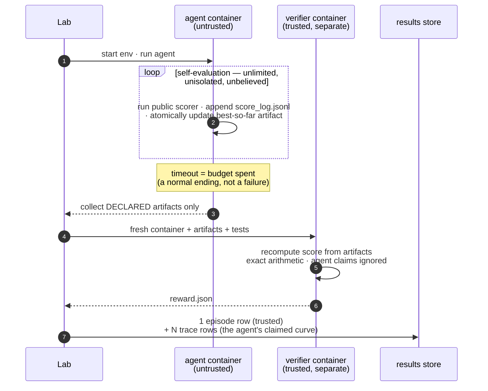

# 🌊 tide

[](https://github.com/Human-Agent-Society/tide-eval/actions/workflows/ci.yml)
[](pyproject.toml)
[](LICENSE)

**Autoresearch evaluation infrastructure on the [Harbor](https://github.com/laude-institute/harbor) task standard.**

**Autoresearch** tasks are open-ended optimization problems with an
hours-long budget and a *continuous* score: pack circles tighter, make this
kernel faster, compress this string further. The agent evaluates itself
hundreds of times along the way; there is no "passed", only "how good, by
when". Evaluating that regime honestly needs machinery a pass/fail harness
doesn't have — a tamper-proof wall between the agent's claims and the real
score, budget semantics where being killed at the deadline still grades,
the self-eval trajectory as data, and sweeps that survive crashes.

tide is that machinery. Tasks are 100% stock Harbor tasks; agents are
anything that can work inside a container — including your own harness.

## What's in the box

| You get | Concretely |
|---|---|
| **A trusted score per episode** | verifier recomputes it in a separate container from declared artifacts only; agent claims are ignored (cheat vectors are tested in CI) |
| **The self-eval trajectory** | every `score_log.jsonl` line the agent wrote, as queryable `trace` rows next to the trusted score |
| **Budget semantics** | timeout = budget spent, a normal ending: the verifier grades the best-so-far artifact the budget bought |
| **Resumable sweeps** | every episode has an idempotency key; re-running a crashed sweep skips finished episodes |
| **Metrics as queries** | anytime curve, AUC, budget-scaling — pandas functions over one results table, no pipeline |
| **A task catalog** | 6 first-party tasks (oracle- and cheat-verified in CI) + EdgeBench (51) + FrontierCS 2.0 (20, incl. 4 GPU kernel tasks) committed in-repo, AlgoTune (154) via the Harbor registry, and a template that makes your own task a five-minute copy-paste |
| **Full provenance** | every stored number's `uri` points at the Harbor trial directory that produced it: logs, artifacts, verifier output |

## Quick start

```bash
pip install tide-eval            # core: no containers, no heavy deps
pip install "tide-eval[harbor]"  # + the real Harbor executor (needs Docker)
```

One command runs a task, a whole category, or a registry benchmark:

```bash
tide list                                                    # what's runnable
tide run autoresearch --agent oracle                         # all 6 first-party tasks (Docker)
tide run tasks/autoresearch/tsp-tour --agent claude-code --model anthropic/claude-opus-5
tide run edgebench/ann_vector_search_qps --agent codex --budget 2     # budget in hours
tide run algotune/psd_cone_projection --agent claude-code --model ... # Harbor registry id
tide report                                                  # summarize the store
tide run autoresearch --agent oracle --fake                  # no Docker: offline smoke
```

Try the API shape without Docker (30 seconds), then the real thing:

```bash
python examples/quickstart.py           # offline, fake executor
python examples/run_circle_packing.py   # real containers: oracle proves the pipeline
```

## Bring your agent

An "agent" is anything Harbor can run against the task container. Three
integration levels, cheapest first — in every case the task, the wall, the
budget, and the results store are identical, so numbers stay comparable
across methods:

**1 · A supported harness (zero code).** Harbor ships adapters for the
mainstream agent CLIs — `claude-code`, `codex`, `aider`, `cursor-cli`,
`terminus-2`, and more — plus `oracle` (runs the task's own solution) and
`nop` (does nothing). Name it, pick a model, go:

```bash
tide run autoresearch --agent claude-code --model anthropic/claude-opus-5
```

**2 · Your own harness (one class).** Implement Harbor's `BaseAgent` —
`setup()` installs whatever your harness needs into the container, `run()`
drives your loop (your models, your tools, your orchestration) against the
environment. Reference it by import path; the dict passes verbatim to
Harbor's `AgentConfig`:

```python
row = await lab.run(
    "tasks/autoresearch/circle-packing",
    agent={"import_path": "my_pkg.my_agent:MyAgent", "model_name": "..."},
)
```

**3 · Your method isn't an "agent" at all.** An evolutionary search, a
solver portfolio, a bare sampling loop — anything qualifies. The task
contract is deliberately tiny: *keep your best solution written to the
declared artifact path, and (optionally) append self-scores to
`score_log.jsonl`*. A `BaseAgent.run()` that installs and launches your
optimizer inside the container is a complete integration; the public scorer
baked into every task image gives your method its inner-loop feedback
signal for free.

The only thing you can never bring: your own grader. Trusted scores come
from the task's verifier, in its own container, or they don't exist.

## How an episode runs

The design splits evaluation into an untrusted inner world and a trusted
outer one. Inside its container, the agent can self-evaluate freely — and
tamper with anything it likes, because nothing in there is believed. The
trusted score is computed afterwards, in a fresh container that receives
only the artifact files the task declared.



Four task conventions carry this design, all visible in the reference task
[`tasks/autoresearch/circle-packing`](tasks/autoresearch/circle-packing):

1. **Public scorer in the image** — the agent self-evaluates freely;
   deliberately unisolated, because nothing it produces is believed.
2. **The wall** — `environment_mode = "separate"` + declared artifacts:
   grading runs in a fresh container that receives only those files and
   recomputes everything (exact rational arithmetic in the exemplar; a
   5e-9 overlap scores zero).
3. **Timeout = budget** — the agent keeps its best solution atomically
   written at all times, so a deadline kill still grades.
4. **Score log** — one JSON line per self-evaluation; ingested as the
   untrusted progress curve.

The cheat-proofing is a standing test, not a claim:
`tests/test_task_suite.py` feeds every grader its task's cheat vectors —
overlapping circles, float-epsilon violations, forged score claims — and
requires exactly zero for each. CI also runs the oracle agent through real
containers and requires each task's exact known score end-to-end.

## What you get after a run

Everything lands in one append-only store; `lab.df()` is the whole export
story. Two kinds of rows:

| kind | one row per | columns (via tags) | trust |
|---|---|---|---|
| `episode` | task × agent × attempt | `task, reward, budget, attempt, …, uri` | verifier-backed ✅ |
| `trace` | self-evaluation inside an episode | `task, t, score, …` | agent-claimed ⚠️ |

And the questions they answer are one query each:

```python
from tide import Lab, metrics

lab = Lab("runs/exp1")

ep = lab.df("episode")  # final trusted scores
ep.groupby("task")["reward"].agg(["mean", "max", "count"])

curve = metrics.anytime(lab.df("trace"), by=["task"])  # best-so-far over time
metrics.auc(curve[curve.task == "circle-packing"])  # the anytime score

metrics.scaling(ep, by=["model"])  # score vs budget (2h vs 8h buys what?)
```

- **"How good did it get?"** → `episode.reward` (trusted).
- **"How fast did it get there?"** → the anytime curve and its AUC (from
  trace rows — the agent's claimed trajectory, labeled as such).
- **"What does more budget buy?"** → `metrics.scaling` over episodes tagged
  with different budgets.
- **"Can I audit this number?"** → `row.uri` is the Harbor trial directory:
  full logs, the artifacts that were graded, the verifier's output.
- **"My sweep crashed at 60%."** → run the same script again; finished
  episodes are skipped. That's the whole story.

## GPU tasks (kernels, CUDA, ML workloads)

Kernel-optimization and other GPU-bound tasks are plain Harbor tasks with two
extra lines of configuration. tide adds no machinery — the point is that it
doesn't need to:

1. **Declare the requirement** in `task.toml` — validated by Harbor's schema,
   honored natively by Harbor's cloud backends (Modal, Beam, GKE, SkyPilot,
   Daytona, …):

   ```toml
   [environment]
   gpus = 1
   ```

2. **On local Docker**, Harbor merges a task-authored
   `environment/docker-compose.yaml` over its generated one, so GPU access is
   a standard compose device reservation on the `main` service (requires the
   NVIDIA Container Toolkit):

   ```yaml
   services:
     main:
       deploy:
         resources:
           reservations:
             devices:
               - driver: nvidia
                 count: all
                 capabilities: [gpu]
   ```

The same compose-overlay mechanism covers judge sidecars — see the vendored
[FrontierCS GPU kernel tasks](tasks/frontier-cs) (kmeans / knn / ivf-pq /
dbscan), which ship a separate judge container wired exactly this way.
Because tasks stay stock Harbor, a GPU task runs identically under
`harbor trial start`, `tide run`, and any cloud backend. Full guide,
including trustworthy kernel timing: [docs/components/tasks.md](docs/components/tasks.md).

## The task catalog

**Browsable at [`tasks/`](tasks/)** — one folder per benchmark; every task
runs standalone under `harbor trial start` too (enforced by a test).

| Benchmark | What it tests | Run it with |
|---|---|---|
| [`tasks/autoresearch/`](tasks/autoresearch) · 6 first-party | the full protocol: dual scorer, anti-hack wall, budget semantics, score trajectory | `tide run autoresearch --agent <a>` |
| [EdgeBench](https://github.com/ByteDance-Seed/EdgeBench) · 51 tasks, 2–12 h budgets | capability vs interaction time | **all 51 committed** (specs CC-BY-4.0, converted verbatim); `tide run edgebench/<task> --budget <h>`; needs their prebuilt images |
| [FrontierCS 2.0](https://github.com/FrontierCS/Frontier-CS) · 20 tasks, incl. 4 GPU kernel | open-ended CS problems with expert evaluators | **all 20 committed**, generated by their official adapter; `python examples/run_frontiercs.py` |
| [AlgoTune](https://github.com/oripress/AlgoTune) · 154 tasks | speed up code vs a reference | `tide run algotune/<task> --agent <a>` via its [Harbor adapter](https://github.com/laude-institute/harbor/tree/main/adapters/algotune) |

The six first-party tasks each teach one hard part of the category:
exact-arithmetic grading (circle-packing), deceptive landscapes
(function-minimization), combinatorial search (tsp-tour), exact constraint
checking (bin-packing), **the anti-overfitting wall** — graded on held-out
points (symbolic-regression), and **safely grading agent-shipped code** —
sandboxed subprocess, reference deleted first (string-compression).

## Authoring your own task

```bash
cp -r tasks/_template tasks/autoresearch/my-task
```

Work through the `TODO(task)` markers (six files), then run
`pytest tests/test_task_suite.py` — your task is picked up automatically:
oracle score, cheat suite, stock-Harbor validation, zero test code to write.
Keep three agents in rotation while developing: **oracle** (runs
`solution/`, proves the pipeline), **nop** (does nothing, catches leakage),
and a **cheater** (tampers with scorers, must not move the trusted score).
Full guide: [docs/components/tasks.md](docs/components/tasks.md).

## If you already know Harbor

tide imports Harbor as a library and never touches its CLI. We deliberately
did not fork: a fork loses the upstream task ecosystem and its fixes, while
a library keeps both and adds a layer Harbor doesn't have. Tasks remain
100% stock Harbor tasks, and registry ids work unchanged.

| Harbor gives | tide adds |
|---|---|
| Task format, env backends, verifier isolation, regrade, oracle/nop agents | used as-is, pinned |
| `Trial.create/run` for one trial | `Lab`: idempotent keys, bounded concurrency, an append-only **tagged results store** that accretes across scripts and weeks |
| One trusted score per trial | **score trajectories** — the agent's self-reported curve (`score_log.jsonl`), ingested as queryable `trace` rows next to the trusted score |
| pass@k within a job | **cross-run metrics**: anytime/AUC, budget scaling |

## Components

One surface is frozen — `Lab.run`'s signature and the store schema (columns
may be added, never changed). Small modules sit around it, each with a doc
that says how to modify it and which invariants your change must not break:

| Component | Code | What it does | Change it when you need… | Doc |
|---|---|---|---|---|
| **CLI** | `tide/cli.py` | `tide run/list/report/fetch` — the one-command surface; a thin caller of `Lab` | new commands, target resolution | `tide --help` |
| **Lab & store** | `tide/lab.py` · `tide/store.py` | episodes in, DataFrame out | new row kinds, key semantics | [lab.md](docs/components/lab.md) |
| **Executors** | `tide/executors.py` | `EpisodeSpec → EpisodeResult` | a new backend (SSH, cloud, simulator) | [executors.md](docs/components/executors.md) |
| **Trajectory** | `tide/trajectory.py` | `score_log.jsonl` → trace rows | a different score-log convention | (docstring) |
| **Metrics** | `tide/metrics.py` | pure DataFrame functions | a new metric (add one function) | [metrics.md](docs/components/metrics.md) |
| **Tasks** | `tasks/` | the benchmark catalog: vendored + fetchable Harbor tasks | to author tasks or benchmarks | [tasks/README.md](tasks/README.md) · [tasks.md](docs/components/tasks.md) |

Three dependency rules keep it decoupled, and violating any of them is a
design bug: converters see only the task format, never tide internals;
metrics import pandas and nothing from tide; the store holds raw scores and
all normalization happens at query time.

## Design rules

1. **One frozen surface.** `Lab.run`'s signature and the store schema.
   Everything else stays cheap to revisit.
2. **Tasks stay stock Harbor.** No tide-specific fields in `task.toml`, ever.
3. **Trust is walled, never assumed.** Self-evaluation is free because it is
   untrusted; trusted scores come only from separate verifiers.
4. **Persistence lives in data, not processes.** No daemon. Idempotent keys
   make any crashed script resumable.
5. **Abstractions are earned.** A helper enters the library when it has
   repeated in at least two real scripts, not before.

These rules are also the extension mechanism. `Row.kind` is an open string,
executors are a two-line protocol, and metrics are standalone functions — so
future evaluation regimes (task streams with carried state, live
infinite-horizon tasks) slot in as new row kinds, new executors, and new
metric functions without touching the frozen surface. That's the roadmap,
not the present: today tide does one thing well.

## Roadmap

Where this sits today, honestly: the core is small, tested, and the
autoresearch pipeline is proven end-to-end in CI (the E2E workflow runs the
oracle through real containers and requires exact scores — it caught two
real bugs on its first runs).

- [ ] **PyPI release** — publish `tide-eval` (the name is reserved in
  pyproject; not yet released)
- [ ] **A GPU exemplar task in CI** — a first-party kernel task with the
  compose-overlay GPU wiring, oracle-gated on a GPU runner
- [ ] **Harbor pin upgrades** — golden-file workflow for bumping the pinned
  version safely
- [ ] **More converters** — the autoresearch corner of the ecosystem is
  bigger than our catalog
- [ ] **A hosted results viewer** — `lab.df()` is enough for research use;
  a shared leaderboard view is not built
- [ ] **Beyond autoresearch** — continual-learning task streams and live
  infinite-horizon tasks, designed to land as extensions (new row kinds +
  executors), not rewrites

## Development

```bash
git clone https://github.com/Human-Agent-Society/tide-eval && cd tide-eval
uv venv --python 3.12 && uv pip install -e . pytest pytest-asyncio ruff
.venv/bin/python -m pytest tests/ -q     # harbor tests skip if absent
uv pip install -e path/to/harbor         # optional: enables the integration tests
.venv/bin/ruff check . && .venv/bin/ruff format --check .
```

Contributions welcome — see [CONTRIBUTING.md](CONTRIBUTING.md) for the design
rules PRs are reviewed against. Licensed [Apache-2.0](LICENSE).
