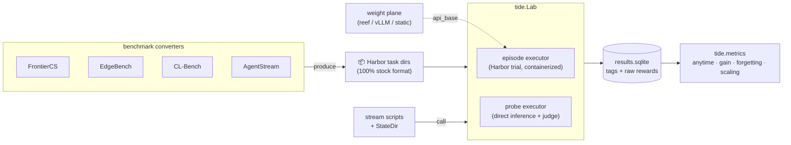
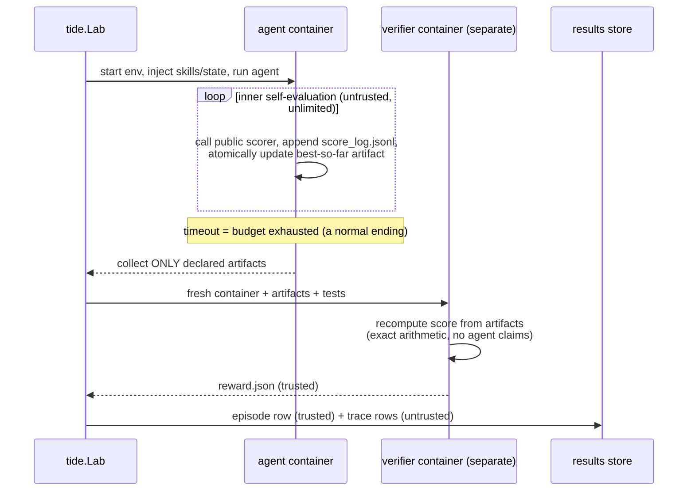
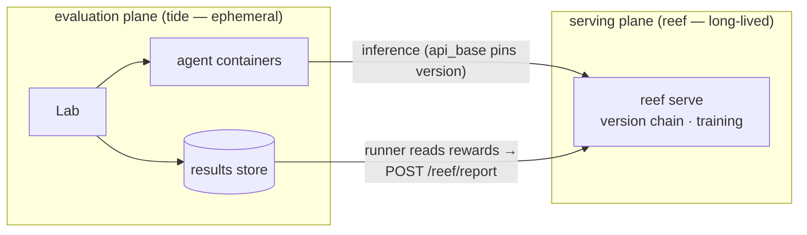

# 🌊 tide

**Continual evaluation infrastructure on the [Harbor](https://github.com/laude-institute/harbor) task standard.**

Harbor answers *"how do I score an agent on one task, once, trustworthily?"*
tide answers the questions that come after: *how do I score an agent that
self-evaluates a thousand times inside one budget?* (autoresearch) — *how do I
score a learner whose memory, skills, or weights evolve across an ordered
stream of tasks?* (continual learning) — *how do I score something that never
finishes?* (live, infinite-horizon tasks).

The whole design reduces every one of those to **two primitives**:

- an **episode** — one *trusted measurement*: a Harbor task run under an
  agent, producing a verifier-backed score. How many times the agent
  self-evaluated inside is irrelevant; an episode boundary exists wherever
  *the harness* needs a number it can trust.
- a **stream** — an ordered sequence of episodes where **one folder of state
  is the only thing allowed to cross the boundaries** (and for model weights,
  a version reference instead of a folder). Streams may be infinite.

Everything else — benchmarks, protocols, metrics — is converters, scripts,
and pandas.



---

## 1 · Quick start

```bash
pip install tide-eval            # core: no containers, no heavy deps
pip install "tide-eval[harbor]"  # + the real Harbor executor (needs Docker)
```

**Thirty seconds, no Docker** — see the API shape with the fake executor:

```bash
python examples/quickstart.py
```

```python
from tide import Lab

lab = Lab("runs/exp1")                      # a directory: results db + trial dirs

row = await lab.run(                        # one episode = one trusted score
    task="terminal-bench/hello-world",      # any Harbor task dir or registry id
    agent={"name": "claude-code", "model_name": "anthropic/claude-opus-5"},
    tags={"attempt": 0},                    # free-form labels — your dimensions
)
print(row.rewards)                          # {'reward': 1.0}

df = lab.df()                               # everything as pandas; metrics are queries
```

Three properties you rely on from day one:

1. **Idempotency = resume.** Every episode has a key (auto-derived or yours
   via `key=`). Re-running a crashed script skips completed keys and picks up
   where it died. This is the *only* resume mechanism, and it's enough.
2. **Tags are your schema.** There is no fixed result cube — a forgetting
   matrix and a budget-scaling curve are both pivots over `lab.df()`.
3. **Every number is auditable.** Each row's `uri` points at the Harbor trial
   directory that produced it (full logs, artifacts, trajectory).

**The real thing** — run the autoresearch exemplar end-to-end (Docker):

```bash
python examples/run_circle_packing.py                       # oracle: proves the pipeline
python examples/run_circle_packing.py --agent claude-code \
    --model anthropic/claude-opus-5                         # a real attempt
```

**A full continual-learning stream, offline:**

```bash
python examples/stream_cl.py    # ingest → probe → gain & forgetting, in one file
```

---

## 2 · If you already know Harbor

tide **imports Harbor as a library and never touches its CLI**. Tasks stay
100% stock Harbor tasks — any task here runs standalone under
`harbor trial start`, and all ~80 registry datasets work here unchanged. We
deliberately did *not* fork: a fork loses the upstream task ecosystem and bug
fixes; a library keeps them and adds what Harbor doesn't have.

What Harbor gives us and what tide adds on top:

| | Harbor has it | tide adds |
|---|---|---|
| Task format, env backends, verifier isolation, regrade, oracle/nop | ✅ used as-is | — |
| Programmatic runs | `Trial.create/run` (per trial) | `Lab`: idempotent keys, bounded concurrency, **append-only tagged results store** |
| One trusted score per trial | ✅ | **Score trajectories**: untrusted intermediate scores (`score_log.jsonl`) ingested as queryable `trace` rows |
| Batch stats (pass@k) | job-scoped | **Cross-run metrics**: anytime/AUC, budget scaling, gain, forgetting, internalization — over a store that accretes for weeks |
| Stateless trials | by design | **Streams**: git-versioned `StateDir` as the single cross-episode channel; frozen probes; fresh-control arms |
| Container-scored tasks | ✅ | **Probe executor**: direct inference + rubric judge, no container — dense per-phase capability tracking at API cost |
| — | — | **WeightPlane**: a 2-method, vendor-neutral contract for evolving-weights learners (reef, vLLM, anything) |

The conceptual contributions, in one breath: *episode boundaries are where
the harness needs trust, not where the agent stops working; state crosses
episodes through exactly one audited channel; untrusted self-evaluation is
free while trusted measurement is walled; and every metric is a query, not a
pipeline.*

### How an episode actually runs



---

## 3 · Components

One frozen surface (`Lab.run`'s signature and the store schema), five small
modules around it. Each has a focused sub-doc explaining how to modify it and
which invariants must survive your change:

| Component | Code | What it is | Modify it when… | Doc |
|---|---|---|---|---|
| **Lab & store** | `tide/lab.py`, `tide/store.py` | The frozen surface: episodes/probes in, DataFrame out | you need new row kinds or key semantics | [docs/components/lab.md](docs/components/lab.md) |
| **Executors** | `tide/executors.py` | `EpisodeSpec → EpisodeResult`; Harbor + Fake | you want a new backend (SSH, cloud API, simulator) | [docs/components/executors.md](docs/components/executors.md) |
| **Probes** | `tide/probe.py` | Direct inference + rubric judging | you need a different judge/aggregation | [docs/components/probe.md](docs/components/probe.md) |
| **Stream tooling** | `tide/stream.py` | `StateDir` (git-versioned state), `WeightPlane` | you have a new state channel or serving stack | [docs/components/stream.md](docs/components/stream.md) |
| **Metrics** | `tide/metrics.py` | Pure `DataFrame → DataFrame` functions | you need a new metric (just add a function) | [docs/components/metrics.md](docs/components/metrics.md) |
| **Tasks** | `examples/tasks/` | Stock Harbor task dirs + tide conventions | you're authoring tasks/benchmarks | [docs/components/tasks.md](docs/components/tasks.md) |

Dependency rules that keep it decoupled — violating one is a design bug:
converters see only the task format, never tide internals; the core doesn't
know streams exist (stream scripts are pure *callers* of `Lab`); metrics
import pandas, never the core; the store holds raw scores, normalization is
query-time.

---

## 4 · Supported benchmarks & tasks

Legend: ✅ works today · 🔧 pattern shipped (exemplar/example in-repo) ·
🗺️ mapping documented, converter welcome.

### Episodic / agentic (the Harbor ecosystem)

| Benchmark | What it tests | Status |
|---|---|---|
| [terminal-bench 2](https://github.com/laude-institute/terminal-bench) | agentic terminal tasks | ✅ any registry id, e.g. `lab.run("terminal-bench/hello-world", ...)` |
| [SWE-bench family](https://github.com/laude-institute/harbor/tree/main/adapters) + ~80 registry datasets | software engineering, QA, reasoning | ✅ via Harbor registry / adapters |

### Autoresearch / open-ended optimization (continuous scores, budgets)

| Benchmark | What it tests | Status |
|---|---|---|
| [FrontierCS](https://github.com/FrontierCS/Frontier-CS) — 240 open problems (Erdős constructions, BBOPlace, NP-hard variants) | open-ended CS; iterative `submit.sh` self-scoring; final = max(final, best submission) | ✅ their repo exports **Harbor-native datasets**; point `lab.run` at them |
| [AlgoTune](https://github.com/oripress/AlgoTune) — 154 speedup tasks | optimize code vs reference, continuous speedup | ✅ via the [harbor adapter](https://github.com/laude-institute/harbor/tree/main/adapters/algotune) |
| `circle-packing-mini` (in-repo) | the canonical tide exemplar: dual scorer, anti-hack wall, budget semantics, score trajectory | 🔧 [examples/tasks/circle-packing-mini](examples/tasks/circle-packing-mini) |
| [EdgeBench](https://github.com/ByteDance-Seed/EdgeBench) — 51 tasks, 2–12 h budgets | agent capability vs interaction time; two-container judging | 🗺️ JSON spec → task dir is mechanical (their two-container harness ≡ Harbor separate verifier; their rescales are in `metrics.rescale_anchored`) |

### Continual learning / streams

| Benchmark | What it tests | Status |
|---|---|---|
| [CL-Bench (Anthropic)](https://arxiv.org/abs/2606.05661) — 6 domains with shared latent structure | does experience improve performance? (gain isolates learning from capability) | 🔧 stream pattern + `metrics.gain` shipped; see [examples/stream_cl.py](examples/stream_cl.py) |
| [CL-bench / CL-bench Life (Tencent)](https://github.com/Tencent-Hunyuan/CL-bench) — 1,899 + 405 rubric-judged context-learning tasks | converted via **ingest-then-probe**: context goes into learner state, probes run without it; `metrics.internalization` measures what stuck | 🔧 probe executor + judge shipped; converter is a JSONL loop |
| [AgentStream (arXiv 2608.00155)](https://arxiv.org/abs/2608.00155) | any static benchmark, streamed by progressive information reveal | 🗺️ reveal-policy converter produces a stream of stock tasks |
| [SkillLearnBench](https://github.com/cxcscmu/SkillLearnBench) | continual skill generation on real tasks | 🗺️ skills-channel `StateDir` maps directly |

### Live / infinite-horizon

| Pattern | What it tests | Status |
|---|---|---|
| Market trading (Kalshi-style) | infinite stream of measurement windows; verifier observes external ground truth (the exchange's ledger); nop = hold ⇒ score − nop = alpha | 🗺️ fully documented in [docs/components/tasks.md](docs/components/tasks.md#live-tasks); windows may be calendar- or event-triggered |

---

## 5 · Authoring new tasks & benchmarks

The five-minute version (full guide: [docs/components/tasks.md](docs/components/tasks.md)):

**A plain episodic task** is just a Harbor task —
`task.toml + instruction.md + environment/ + tests/ + solution/`. Verify it
standalone with `harbor trial start -p <dir>`, then `lab.run(<dir>, ...)`.

**An autoresearch task** adds four conventions (all visible in
[circle-packing-mini](examples/tasks/circle-packing-mini)):

1. bake a **public scorer** into the image — the agent self-evaluates freely,
   unisolated *because it's untrusted*;
2. `[verifier] environment_mode = "separate"` + declared `artifacts` — the
   trusted grade is recomputed in a clean container from declared files only,
   at high precision (epsilon-cheats score zero);
3. **timeout = budget**: instruct the agent to atomically maintain a
   best-so-far artifact; being killed at the deadline still grades it;
4. the agent appends `{"t": ..., "score": ...}` lines to `score_log.jsonl`
   — tide ingests them as the (untrusted) progress curve.

**A benchmark converter** is a script that emits a folder of such task dirs
(plus, for streams, an ordered manifest). Converters depend only on the task
format — never on tide internals — so they cannot break anything.

**A stream protocol** is a Python loop, on purpose (feedback policies and
probe sampling are natural `if`s and `for`s; a YAML DSL would grow fields
forever):

```python
state = StateDir("runs/exp/state")
for i, doc in enumerate(corpus):
    ingest(state.path, doc)                      # your learner, your rules
    ref = state.snapshot(f"phase {i}")           # frozen, diffable, replayable
    frozen = state.materialize(ref)              # probes can't touch live state
    for j in sample(range(i + 1)):
        await lab.probe(probes[j], model_with(frozen),
                        tags={"phase": i, "arm": "stateful"})
        await lab.probe(probes[j], model_with(None),
                        tags={"phase": i, "arm": "fresh"})   # control arm
```

Three test agents keep every task honest: **oracle** (runs `solution/`;
proves the pipeline), **nop** (does nothing; the leakage baseline), and a
**cheater** (tampers with scorers and logs; proves the wall — tide's own
grader test does exactly this).

---

## 6 · Plugging in reef (or any learning stack)

tide has **zero reef dependency** — the decoupling is a two-method protocol:

```python
class WeightPlane(Protocol):
    def snapshot(self) -> str: ...        # freeze current weights → version ref
    def serve(self, ref: str) -> str: ... # any historical ref → OpenAI-compatible URL
```

[reef](https://github.com/Human-Agent-Society/reef) implements it naturally
(version chain, CAS publish, per-request attribution); so does vLLM plus a
checkpoint directory; a static model implements it trivially
(`StaticWeightPlane`, used as the fresh-control arm).



One lap of the loop (full file: [examples/reef_weightplane.py](examples/reef_weightplane.py)):

```python
ref = plane.snapshot()                                # freeze current weights
row = await lab.run(task, {
    "name": "terminus-2",                             # host-side brain: container stays offline
    "kwargs": {"api_base": plane.serve(ref)},         # version-pinned inference
}, tags={"version": ref})
report(score=row.rewards["reward"], references=[ref]) # reef trains; next lap, new ref
```

Rewards accumulate as `(version, task, reward)` rows — learning curves,
gain vs a static control, and forgetting matrices are queries from then on.
A probe battery always pins the `ref` it started with, so asynchronous
training can never dirty a measurement mid-battery.

---

## Design rules (the short list)

1. **One frozen surface.** `Lab.run`'s signature and the store schema; the
   store only ever gains columns. Everything else is cheap to revisit.
2. **Tasks stay stock Harbor.** Streams are manifests *around* tasks, never a
   dialect inside them.
3. **Trust is walled, not assumed.** Untrusted self-evaluation is free;
   trusted scores come only from separate verifiers (recompute) or external
   ground truth (observe).
4. **State crosses episodes through one audited channel.** A git-versioned
   folder, or a version ref for weights. Environments are always disposable.
5. **Persistence lives in data, not processes.** No daemon; idempotent keys
   make any crashed script resumable.

## Development

```bash
uv venv --python 3.12 && uv pip install -e . pytest pytest-asyncio
uv pip install -e path/to/harbor        # optional: enables integration tests
.venv/bin/python -m pytest tests/ -q    # 43 tests; harbor tests skip if absent
```

Licensed Apache-2.0.
