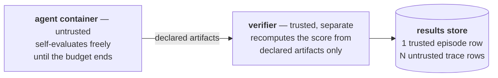

# 🌊 tide

[](https://github.com/Human-Agent-Society/tide-eval/actions/workflows/ci.yml)
[](pyproject.toml)
[](LICENSE)

**Autoresearch evaluation on the [Harbor](https://github.com/laude-institute/harbor) task standard.**

Autoresearch tasks are open-ended optimization problems: hours of budget,
a continuous score, and an agent that evaluates itself hundreds of times
along the way. There is no "passed" — only *how good, by when*. tide
evaluates that regime honestly:

| | |
|---|---|
| **Trusted score** | a separate verifier container recomputes it from declared artifacts; agent claims are ignored (cheat-tested in CI) |
| **Score trajectory** | every self-eval the agent claimed, stored as queryable `trace` rows |
| **Budget semantics** | timeout is a normal ending — the best-so-far artifact still grades |
| **Resumable sweeps** | idempotency keys: re-run a crashed sweep, finished episodes skip |
| **Metrics = queries** | anytime curve, AUC, budget scaling — pandas over one table, every number auditable via its trial `uri` |

Tasks are 100% stock Harbor tasks (enforced by test). Agents are anything
that can work inside a container — including your own harness or method.



Full design — trust model, task conventions, data model, extensibility:
**[docs/design.md](docs/design.md)**.

## Run

```bash
pip install "tide-eval[harbor]"          # needs Docker; plain tide-eval = core only

tide list                                # what's runnable
tide run autoresearch --agent oracle     # all 6 first-party tasks
tide run edgebench/ann_vector_search_qps --agent codex --budget 2   # hours
tide report                              # summarize the results store
```

No Docker? `tide run autoresearch --agent oracle --fake` and
`python examples/quickstart.py` run offline in seconds;
`python examples/run_circle_packing.py` then proves the real pipeline
(the oracle must score exactly 0.75).

## Use the API

A `Lab` is a directory; `run` is one episode; `df` is the export story:

```python
from tide import Lab, metrics

lab = Lab("runs/exp1")
row = await lab.run(
    "tasks/autoresearch/circle-packing",  # any task dir or Harbor registry id
    agent={"name": "claude-code", "model_name": "anthropic/claude-opus-5"},
    tags={"budget": 2},  # free-form tags = your schema
)
row.rewards  # trusted score          row.uri → the auditable trial dir

curve = metrics.anytime(lab.df("trace"))  # claimed progress over time
metrics.auc(curve)  # the anytime score
metrics.scaling(lab.df("episode"), by=["model"])  # what does more budget buy?
```

Re-running any script resumes it. Reference:
[lab](docs/components/lab.md) · [metrics](docs/components/metrics.md) ·
[executors](docs/components/executors.md).

## Evaluate *your* agent

Same tasks, same wall, same store — numbers stay comparable across methods:

| You have | Integration |
|---|---|
| a mainstream harness (`claude-code`, `codex`, `aider`, …) | `--agent <name> --model <m>` — zero code |
| your own harness | one `BaseAgent` subclass, referenced via `import_path` |
| a method that isn't an "agent" (OpenEvolve-style search, a solver) | keep your best solution at the artifact path; optionally log self-scores |

The container contract is identical across all six first-party tasks, so
one integration covers the suite. The only thing you cannot bring is your
own grader. Full guide with the `BaseAgent` skeleton and a worked
OpenEvolve example: **[docs/integration.md](docs/integration.md)**.

## Define a new task

```bash
cp -r tasks/_template tasks/autoresearch/my-task
pytest tests/test_task_suite.py          # picked up automatically
```

Six `TODO(task)` files (config, instruction, public scorer, trusted
grader, cheat vectors, oracle solution); the suite checks oracle score,
cheats, and Harbor validity with zero test code. GPU tasks add two lines
of config. Guide: **[docs/components/tasks.md](docs/components/tasks.md)**.

## Tasks

| Benchmark | Tasks | Run |
|---|---|---|
| [first-party](tasks/autoresearch) ↓ | 6 | `tide run autoresearch --agent <a>` |
| [EdgeBench](tasks/edgebench) | 51 · 2–12 h budgets | `tide run edgebench/<task> --budget <h>` |
| [FrontierCS 2.0](tasks/frontier-cs) | 20 · incl. 4 GPU kernel | `python examples/run_frontiercs.py` |
| [AlgoTune](https://github.com/oripress/AlgoTune) | 154 · via Harbor registry | `tide run algotune/<task> --agent <a>` |

Each first-party task teaches one hard part of the category
(oracle-verified in real containers, cheat-vector-tested in CI):

| Task | Teaches |
|---|---|
| [`circle-packing`](tasks/autoresearch/circle-packing) | the full protocol; exact-arithmetic grading |
| [`function-minimization`](tasks/autoresearch/function-minimization) | exploration vs local search |
| [`tsp-tour`](tasks/autoresearch/tsp-tour) | combinatorial search, continuous signal |
| [`bin-packing`](tasks/autoresearch/bin-packing) | exact constraint checking |
| [`symbolic-regression`](tasks/autoresearch/symbolic-regression) | anti-overfitting: graded on held-out points |
| [`string-compression`](tasks/autoresearch/string-compression) | safely grading agent-shipped code |

## Roadmap

- [ ] PyPI release (`tide-eval` — name reserved, not yet published)
- [ ] GPU exemplar task, oracle-gated in CI
- [ ] Harbor pin-upgrade workflow
- [ ] More autoresearch converters
- [ ] Hosted results viewer
- [ ] Beyond autoresearch: continual-learning streams and live tasks — as
  [extensions](docs/design.md#extensibility), not rewrites

## Development

```bash
git clone https://github.com/Human-Agent-Society/tide-eval && cd tide-eval
uv venv --python 3.12 && uv pip install -e . pytest pytest-asyncio ruff
.venv/bin/python -m pytest tests/ -q     # harbor tests skip if absent
.venv/bin/ruff check . && .venv/bin/ruff format --check .
```

Design rules for PRs: [CONTRIBUTING.md](CONTRIBUTING.md) ·
License: [Apache-2.0](LICENSE)
