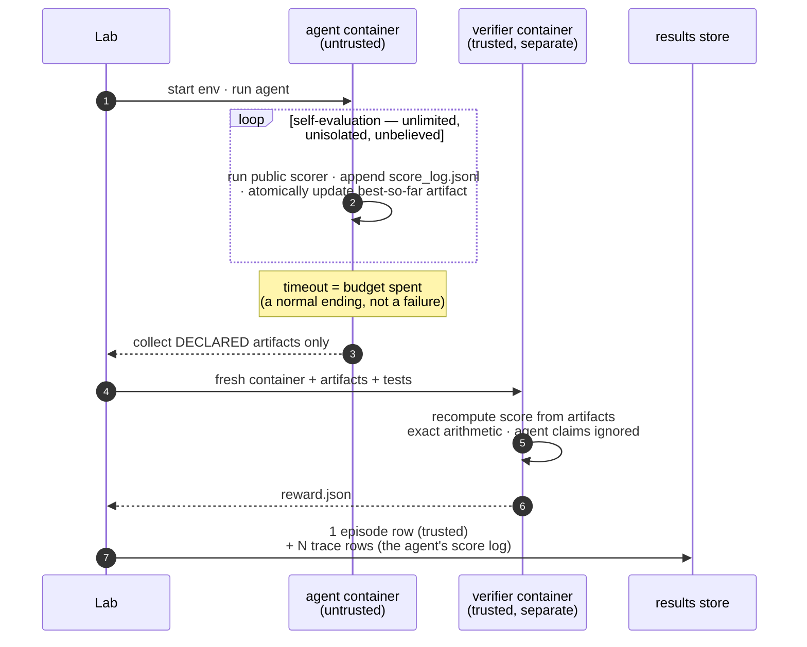

# Design

How tide evaluates autoresearch, and why it is shaped the way it is.
For the module-by-module reference see [components/](components/); for
integrating an agent see [integration.md](integration.md).

## What an autoresearch task is

An autoresearch task is an open-ended optimization problem with three
properties that break a pass/fail harness:

- **continuous score** — "how good", not "did it pass";
- **a budget, not a finish line** — the agent works until time runs out, and
  being killed at the deadline is a normal ending that must still grade;
- **self-evaluation in the loop** — the agent scores itself hundreds of
  times to guide its own search, and those numbers cannot be trusted,
  because the agent controls the machine they were computed on.

Everything in tide follows from taking those three properties seriously.

## The trust model

The design splits evaluation into an untrusted inner world and a trusted
outer one:

Inside its container the agent may tamper with anything — the scorer, the
logs, the filesystem — because nothing in there is believed. The trusted
score is computed afterwards in a fresh container that receives **only the
artifact files the task declared**, recomputes everything from them, and
never reads agent-claimed numbers. Self-evaluation is free *because* it is
untrusted; verifier isolation is what makes that freedom safe.

Four task conventions carry the model (reference implementation:
[`tasks/autoresearch/circle-packing`](../tasks/autoresearch/circle-packing)):

| # | Convention | Mechanism |
|---|---|---|
| 1 | **Public scorer in the image** | `environment/scorer.py` — the agent's inner-loop feedback; deliberately unisolated |
| 2 | **Verifier isolation** | `environment_mode = "separate"` + `artifacts = [...]` in `task.toml`; `tests/grade.py` recomputes from artifacts alone |
| 3 | **Timeout = budget** | the instruction mandates atomic best-so-far writes (temp file + rename), so a deadline kill still grades |
| 4 | **Score log** | `{"t": sec, "score": x}` lines appended to `score_log.jsonl` — on every improvement at minimum, every self-eval ideally (`metrics.improvements` needs the latter); ingested as untrusted `trace` rows |

Trust is tested, not asserted. `tests/test_task_suite.py` feeds every
grader its task's cheat cases — overlapping circles, float-epsilon
violations, forged score claims — and requires exactly zero for each. The
E2E workflow additionally runs the oracle agent (Harbor's built-in agent
that executes a task's reference solution) through real containers on
every first-party task and requires its exact known score.

## The data model

One append-only store (SQLite, one per `Lab` directory), one row shape,
two kinds:

| kind | one row per | key shape | trust |
|---|---|---|---|
| `episode` | one task run (= one Harbor trial) | `<key>` | verifier-backed |
| `trace` | self-evaluation inside an episode | `<key>#t<i>` | agent-claimed |

Three load-bearing decisions:

- **Idempotency keys are the resume story.** Every episode's key is derived
  from (task, agent, tags, overrides) — or supplied explicitly. A key that
  already has a row is skipped, so re-running a crashed sweep resumes it.
  There is no daemon and no job state: persistence lives in the data.
- **Tags are the schema.** Budgets, attempts, models, suites are free-form
  tags; a budget-scaling curve and a model comparison are both pivots over
  `lab.df()`. Metrics declare the columns they expect; nothing fixes a
  result format up front.
- **Raw scores in the store, normalization at query time.** Re-anchoring a
  0–100 scale never requires re-running anything.

Every row's `uri` points at the Harbor trial directory that produced it —
logs, graded artifacts, verifier output — so any number in any table can be
audited back to its evidence.

**A trusted curve, when you need one.** The score-over-time curve is
self-reported and stays that way — it is free precisely because it is
untrusted, and faking it cannot move the benchmark number. When you need
intermediate points you can trust, run the same task at several budgets:
each episode's final score is verifier-backed, and `metrics.scaling`
assembles them into a curve whose every point is trusted. That costs real
re-runs, which is the price of trust here. A finer-grained option — the
verifier re-scoring timestamped snapshots inside one episode, stored as a
new row kind — fits the store design but is not built.

## Why Harbor, as a library

Harbor already solved single-trial evaluation well: task format, container
backends, verifier isolation, agent adapters. tide imports it as a library
and never touches its CLI — a fork would lose the upstream task ecosystem;
a wrapper keeps it. Tasks remain 100% stock Harbor tasks (enforced by
test): every task here also runs standalone under `harbor trial start`, and
Harbor registry ids run here unchanged. tide's own surface stays small on
purpose — roughly: `Lab` (orchestration + store), an `Executor` protocol
with a Harbor implementation, score-log ingestion, and pure-pandas
metrics. See [components/](components/) for each module's invariants.

## Extensibility

The frozen interface is deliberately minimal — `Lab.run`'s signature and the
store schema (columns may be added, never changed) — and the extension
points are structural rather than speculative:

- `Row.kind` is an open string: a future regime adds new kinds with their
  own key shapes, no schema change;
- `Executor` is a one-method protocol (`execute(spec) → result`): new
  backends (SSH, cloud batch, a simulator, an external-ground-truth
  observer) never touch the core;
- metrics are standalone functions over the one table: a new metric is one
  function plus a docstring declaring its expected columns.

This is how continual-learning task streams and live infinite-horizon
tasks are planned to land: as additions around the same store, not
rewrites of it. None of that machinery exists today, deliberately.

## Design rules

1. **One frozen interface.** `Lab.run`'s signature and the store schema.
2. **Tasks stay stock Harbor.** No tide-specific fields in `task.toml`, ever.
3. **Trust is isolated, never assumed.** Trusted scores come only from
   separate verifiers; every anti-cheating measure ships with tests that
   actually cheat.
4. **Persistence lives in data, not processes.** No daemon; idempotent keys
   make any crashed script resumable.
5. **Abstractions are earned.** A helper enters the library when it has
   repeated in at least two real scripts, not before.
