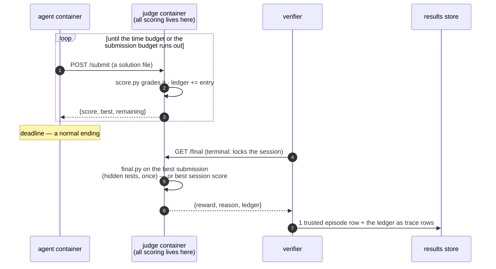

# Design

How tide evaluates autoresearch, and why it is shaped the way it is.
For the module-by-module reference see [components/](components/); for
integrating an agent see [integration.md](integration.md).

## What an autoresearch task is

An autoresearch task is an open-ended optimization problem with three
properties that break a pass/fail harness:

- **continuous score** — "how good", not "did it pass";
- **a budget, not a finish line** — the agent works until time runs out,
  and being stopped at the deadline is a normal ending that must still
  produce a grade;
- **iteration in the loop** — the agent tries many candidates and needs
  feedback on them, and any feedback machinery it can reach it can also
  tamper with.

Everything in tide follows from taking those three properties seriously.

## The trust model: the judge owns all scoring

Two containers. The agent works in one; the judge — an HTTP server holding
every line of scoring code and data — runs in the other. The agent's
network reaches the judge and nothing else.

Three decisions carry the model:

- **One scoring implementation, judge-side.** `score.py` grades every
  submission; the agent sees only scores coming back. There is nothing on
  the agent's side to keep honest, because there is nothing on the agent's
  side at all — it may build its own local evaluator for its inner loop
  (the objective is in the instruction), and tide neither requires nor
  trusts that.
- **The submission budget** (`judge_config.json`) bounds judge compute and
  information leakage — the same dial Kaggle turns with daily submission
  limits. Refused submissions never enter the ledger.
- **The final judge is terminal.** `final.py` (optional) holds hidden
  tests — held-out data, stricter checks — and runs exactly once, on the
  best submission, when the verifier calls `GET /final`. That call locks
  the session: later submissions are refused and repeat calls return the
  cached verdict, so an agent that peeks early ends its own run.
  [symbolic-regression](../tasks/autoresearch/symbolic-regression) is the
  reference: session feedback on training points, final grade on held-out
  points that no submission budget can probe.

Trust is tested, not asserted: `tests/test_task_suite.py` feeds every
scorer its task's cheat cases — out-of-bounds values, float-epsilon
exploits, forged fields — and requires exactly zero for each; the E2E
workflow runs the oracle agent (Harbor's built-in agent that executes a
task's reference solution) through real containers and requires its exact
known score.

## The curve is trusted

Because every submission is judge-scored, the ledger — ingested as `trace`
rows — is a **trusted** score-over-time record. The anytime curve, its
AUC, time-to-threshold, and improvement counts are queries over real
measurements, not the agent's claims. This is the payoff of paying one
judge evaluation per submission, and the submission budget is what keeps
that price bounded.

## The data model

One append-only store (SQLite, one per `Lab` directory), one row shape,
two kinds:

| kind | one row per | key shape | source |
|---|---|---|---|
| `episode` | one task run (= one Harbor trial) | `<key>` | the judge's final verdict |
| `trace` | one submission | `<key>#t<i>` | the judge's ledger |

Three load-bearing decisions:

- **Idempotency keys are the resume story.** Every episode's key is derived
  from (task, agent, tags, overrides) — or supplied explicitly. A key that
  already has a row is skipped, so re-running a crashed sweep resumes it.
  There is no daemon and no job state: persistence lives in the data.
  Resume is deliberately episode-granular: a half-finished 12-hour episode
  starts over, because a run stitched together from checkpoints is not the
  same measurement as one clean budget — and would not be comparable to
  anyone else's.
- **Tags are the schema.** Budgets, attempts, models, suites are free-form
  tags; a budget-scaling curve and a model comparison are both pivots over
  `lab.df()`. Metrics declare the columns they expect; nothing fixes a
  result format up front.
- **Raw scores in the store, normalization at query time.** Re-anchoring a
  0–100 scale never requires re-running anything.

Every row's `uri` points at the Harbor trial directory that produced it —
logs, the judge's ledger, the verifier's output — so any number in any
table can be audited back to its evidence.

## Why Harbor, as a library

Harbor already solved single-trial evaluation well: task format, container
backends, sidecar wiring, agent adapters. tide imports it as a library
and never touches its CLI — a fork would lose the upstream task ecosystem;
a wrapper keeps it. Tasks remain 100% stock Harbor tasks (enforced by
test): every task here also runs standalone under `harbor trial start`, and
Harbor registry ids run here unchanged. tide's own surface stays small on
purpose — roughly: `Lab` (orchestration + store), an `Executor` protocol
with Harbor and local implementations, ledger ingestion, and pure-pandas
metrics. See [components/](components/) for each module's invariants.

## Extensibility

The frozen interface is deliberately minimal — `Lab.run`'s signature and
the store schema (columns may be added, never changed) — and the extension
points are structural rather than speculative:

- `Row.kind` is an open string: a future regime adds new kinds with their
  own key shapes, no schema change;
- `Executor` is a one-method protocol (`execute(spec) → result`): new
  backends (SSH, cloud batch, a simulator, an external-ground-truth
  observer) never touch the core;
- metrics are standalone functions over the one table: a new metric is one
  function plus a docstring declaring its expected columns.

This is how continual-learning task streams and live infinite-horizon
tasks are planned to land: as additions around the same store, not
rewrites of it. None of that machinery exists today, deliberately.

## Design rules

1. **One frozen interface.** `Lab.run`'s signature and the store schema.
2. **Tasks stay stock Harbor.** No tide-specific fields in `task.toml`, ever.
3. **The judge owns all scoring.** The agent's side carries no scoring
   machinery; every anti-cheating claim ships with tests that actually cheat.
4. **Persistence lives in data, not processes.** No daemon; idempotent keys
   make any crashed script resumable.
5. **Abstractions are earned.** A helper enters the library when it has
   repeated in at least two real scripts, not before.
