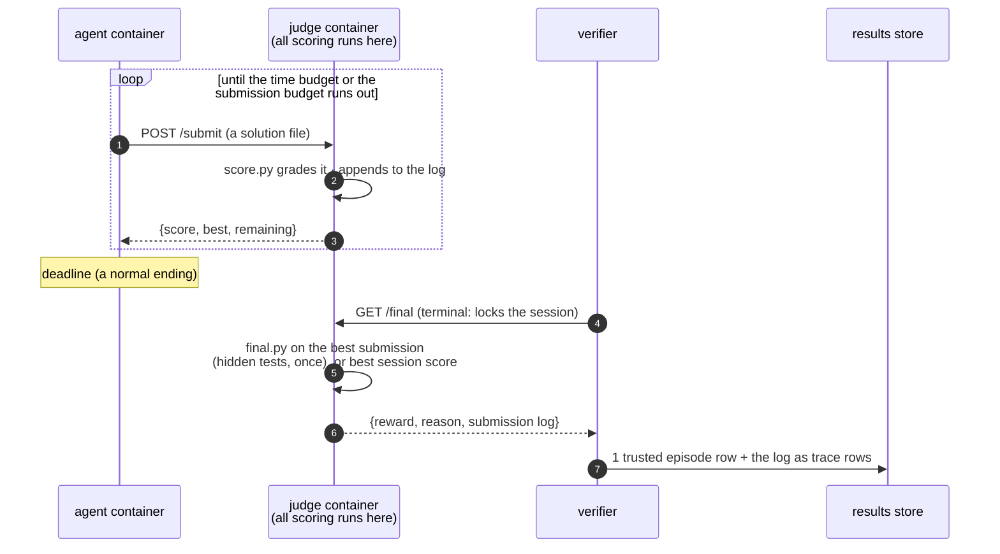

# Design

The ideas tide is built on. For the practical pages see
[get started](get-started.md) and [running agents](running-agents.md).

tide measures what an agent keeps. Something learned during a run counts
when it outlives the episode: memory, a skill library, an evolved
harness, updated weights. In-context reasoning and a retry after an error
count only when what they produced is kept for later runs. The form that
state takes is up to the method.

## The two regimes

**Autoresearch** is one open-ended optimization problem with a continuous
score. The optimum is unknown, so a result is read against other runs and
the budget it used. The budget ends the run, and being stopped at the
deadline still has to produce a grade. The agent iterates against
feedback, and any feedback machinery it can reach it can also tamper
with, which is what the judge below is for.

A [**stream**](get-started.md#streams) is an ordered sequence of stock
Harbor tasks under one agent, the setting used in
[AgentStream](https://arxiv.org/abs/2608.00155) and
[CL-Bench](https://arxiv.org/pdf/2606.05661). Each position is an
ordinary episode with its own container and its own trusted row, and the
only thing connecting them is the state directory the agent carries
(`$TIDE_STATE_DIR`). The measurement is the difference that state makes:
the learning curve over positions, transfer against the same tasks run
alone, forgetting on revisited tasks.

Either regime works with any learning mechanism.

## Reward hacking: scoring runs outside the agent's container

The code and data that grade the agent stay outside its container. In
autoresearch that is the **judge**: an HTTP server in its own container
holding every line of scoring code and data, and the only host the
agent's network can reach.

`score.py` grades every submission and only judge scores are recorded.
The submission budget in `judge_config.json` bounds judge compute and
information leakage, the same mechanism as Kaggle's daily submission
limits. The optional `final.py` holds hidden tests and runs once, on the
best submission, when the verifier calls `GET /final`; that call locks
the session, so an agent that calls it early ends its own run.

In streams the verifier grades each position, and tasks with hidden state
reuse the judge pattern as a sidecar. The state directory the agent
carries is the one surface it writes, and it feeds the agent's later runs
and nothing else.

Both are tested: `tests/test_task_suite.py` feeds every scorer its task's
cheat cases and requires exactly zero for each, and the E2E workflow runs
the oracle agent through real containers and requires its exact known
score.

## One table

Every run appends to one SQLite store per `Lab` directory, with two row
kinds: an `episode` row per task run, and a `trace` row per submission
(`<key>#t<i>`).

- **Tags are the schema.** Budgets, attempts, models, suites and stream
  positions are free-form tags, so a budget-scaling curve, a model
  comparison and a learning curve are all pivots over `lab.df()`.
- **Re-running resumes.** A key that already has a row is skipped, so
  nothing has to keep running between runs. See
  [resume](get-started.md#resume).
- **Raw scores in the store, normalization at query time.** Re-anchoring
  a 0-100 scale is a query over rows you already have.
- **Every row's `uri`** points at the Harbor trial directory that
  produced it, so any number can be traced to the files it came from.

## How streams run

A stream's state directory is snapshotted after each position and
restored before the next, so every step's memory can be read back
afterwards. A position's key covers the history that produced it and its
snapshot carries the same prefix, so two streams sharing a name keep
separate memory. The rest of the mechanics are in
[streams](get-started.md#streams).
