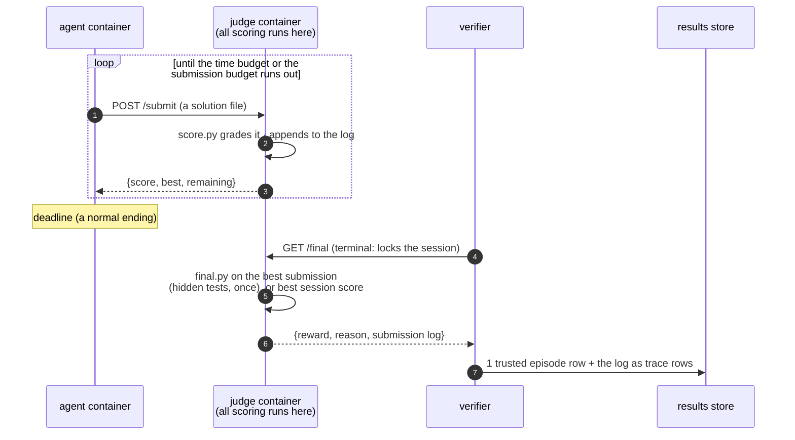

# Design

What tide evaluates, and why it is shaped that way. For the practical
pages see [get started](get-started.md) and
[running agents](running-agents.md).

tide is evaluation infrastructure for self-evolving agents: agents that
learn from signals produced during the run itself and keep what they
learned. It measures what survives the episode, so in-context reasoning,
a retry after an error, and a test-time search count only when something
they produced is kept for later runs. The form that state takes is up to
the method.

## The two regimes

A regime is the shape of the work, and either one can host any learning
mechanism.

An **autoresearch** task is an open-ended optimization problem. Three of
its properties set what the harness has to provide:

- **continuous score**: the objective returns a number and the optimum is
  unknown, so a result is read against other runs and the budget it used;
- **the budget ends the run**: being stopped at the deadline is a normal
  ending that must still produce a grade (see
  [budgets](get-started.md#budgets));
- **iteration in the loop**: the agent tries many candidates and needs
  feedback on them, and any feedback machinery it can reach it can also
  tamper with.

A [**stream**](get-started.md#streams) is an ordered sequence of stock
Harbor tasks run under one agent, the setting used in
[AgentStream](https://arxiv.org/abs/2608.00155) and
[CL-Bench](https://arxiv.org/pdf/2606.05661):

- **each position is one ordinary episode**: one Harbor trial, one
  container, one trusted row; pass/fail tasks work as-is;
- **positions are connected only by the carried state**, mounted into the
  agent's container as `$TIDE_STATE_DIR`;
- **the measurement is the difference that state makes**: the learning
  curve over positions, transfer against the same tasks run alone, and
  forgetting on revisited tasks.

## Reward hacking: scoring runs outside the agent's container

The code and data that grade the agent stay outside its container. In
autoresearch that is the **judge**: an HTTP server in its own container
holding every line of scoring code and data, and the only host the
agent's network can reach.

- **One scoring implementation, judge-side.** `score.py` grades every
  submission and the agent sees only the scores that come back. The agent
  may run its own evaluator for its inner loop; only judge scores are
  recorded.
- **The submission budget** (`judge_config.json`) bounds judge compute
  and information leakage, the same mechanism as Kaggle's daily
  submission limits.
- **The final judge is terminal.** `final.py` (optional) holds hidden
  tests and runs once, on the best submission, when the verifier calls
  `GET /final`. That call locks the session, so an agent that calls it
  early ends its own run.

In streams the verifier grades each position, and tasks with hidden state
reuse the judge pattern as a sidecar (the metered database and the poker
deck in [CL-Bench](https://github.com/Human-Agent-Society/tide-eval/tree/main/tasks/continual-learning/cl-bench)).
The carried state directory is the one surface the agent writes, and it
feeds the agent's later runs and nothing else.

Both are tested: `tests/test_task_suite.py` feeds every scorer its task's
cheat cases and requires exactly zero for each, and the E2E workflow runs
the oracle agent through real containers and requires its exact known
score.

## The data model

One append-only store (SQLite, one per `Lab` directory), one row shape,
two kinds:

| kind | one row per | key shape | source |
|---|---|---|---|
| `episode` | one task run (= one Harbor trial) | `<key>` | what the verifier returned (for judge tasks, the judge's final grade) |
| `trace` | one submission | `<key>#t<i>` | the judge's submission log |

- **Re-running resumes.** An episode's key comes from its task, agent,
  tags and overrides, and a key that already has a row is skipped, so
  nothing has to keep running between runs. Details in
  [resume](get-started.md#resume).
- **Tags are the schema.** Budgets, attempts, models, suites and stream
  positions are free-form tags, so a budget-scaling curve, a model
  comparison and a learning curve are all pivots over `lab.df()`.
- **Raw scores in the store, normalization at query time.** Re-anchoring
  a 0-100 scale is a query over rows you already have.

Every row's `uri` points at the Harbor trial directory that produced it,
so any number can be traced to the files it came from.

## How streams run

The mechanics are in [streams](get-started.md#streams). Two decisions
keep a stream one clean measurement:

- **Every episode starts from a named snapshot**, taken after the
  previous position and restored before this one, so every step's memory
  can be read back afterwards.
- **A position's key covers the history that produced it**, and its
  snapshot carries the same prefix, so two streams sharing a name keep
  separate memory.

Episode rows from a stream are written to the same table, tagged `stream`
and `position`, so the continual-learning metrics are queries like every
other metric.
