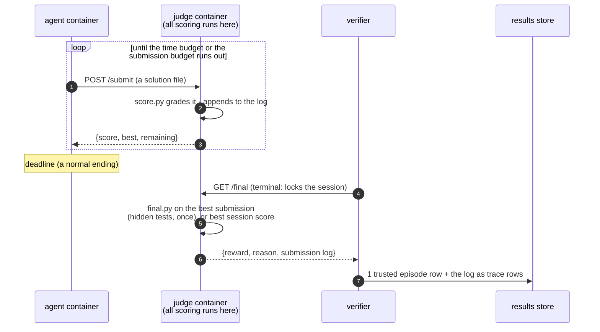

# Design

What tide evaluates, and why it is shaped that way.
For the practical pages see [get started](get-started.md) and
[running agents](running-agents.md).

tide is evaluation infrastructure for self-evolving agents: agents that
learn from signals produced during the run itself and keep what they
learned. Continual learning in the broad sense is the same idea, and the
narrow one, weight updates over a task sequence, is one case of it. tide
measures what survives the episode, so in-context reasoning, a retry
after an error, and a test-time search count only when something they
produced is kept for later runs.

The form the learning persists in is up to the method: a method that
updates weights runs its own loop, and tide measures the result. tide
provides the two task regimes where persistence shows up and the
measurements over them.

A regime describes the shape of the work, and either regime can host any
learning mechanism. An autoresearch agent that evolves its own harness
learns continually inside a single problem; a stream whose agent carries
nothing is the stateless baseline `metrics.transfer` compares against.

## The two regimes

An autoresearch task is an open-ended optimization problem. Three of its
properties set what the harness has to provide:

- **continuous score**: the objective returns a number and the optimum is
  unknown, so a result is read against other runs and the budget it used;
- **the budget ends the run**: the agent works until the budget runs
  out (time, evals, tokens, or cost; see [budgets](get-started.md#budgets)),
  and being stopped at the deadline is a normal ending that must still
  produce a grade;
- **iteration in the loop**: the agent tries many candidates and needs
  feedback on them, and any feedback machinery it can reach it can also
  tamper with.

A [stream](get-started.md#streams) is an ordered sequence of stock Harbor
tasks run under one agent, with a state directory carried from task to
task: the setting used in
[AgentStream](https://arxiv.org/abs/2608.00155) and
[CL-Bench](https://arxiv.org/pdf/2606.05661). Its defining properties:

- **each position is one ordinary episode**: one Harbor trial, one
  container, one trusted row; pass/fail tasks work as-is (a pass is a
  0-or-1 score);
- **positions are connected only by the carried state**, mounted into
  the agent's container as `$TIDE_STATE_DIR`, where the agent keeps
  whatever it wants to remember;
- **the measurement is the difference state makes**: the learning curve
  over positions, transfer against an isolated baseline, forgetting on
  revisited tasks. AgentStream's sequential and interleaved scenarios map
  onto target order and a seeded shuffle; its isolated scenario is one
  stream per benchmark, with no state shared between them. The stateless
  baseline `metrics.transfer` subtracts is a plain `lab.run` sweep,
  separate from that isolated scenario.

## Trust: scoring runs outside the agent's container

Both regimes share one rule: the code and data that grade the agent stay
outside its container.

In autoresearch, scoring runs in a **judge**: an HTTP server in its own
container holding every line of scoring code and data. The agent's
network reaches the judge and nothing else.

Three decisions define the judge model:

- **One scoring implementation, judge-side.** `score.py` grades every
  submission, and the agent sees only the scores that come back. The
  agent may build its own local evaluator for its inner loop (the
  objective is in the instruction); only judge scores are recorded.
- **The submission budget** (`judge_config.json`) bounds judge compute and
  information leakage, the same mechanism as Kaggle's daily submission
  limits. Only accepted submissions are recorded.
- **The final judge is terminal.** `final.py` (optional) holds hidden
  tests (held-out data, stricter checks) and runs exactly once, on the
  best submission, when the verifier calls `GET /final`. That call locks
  the session: later submissions are refused and repeat calls return the
  cached verdict, so an agent that calls it early terminates its own
  session.
  [symbolic-regression](https://github.com/Human-Agent-Society/tide-eval/tree/main/tasks/autoresearch/first-party/symbolic-regression)
  is the reference: session feedback on training points, final grade on
  held-out points that no submission budget can probe.

In streams, Harbor's verifier grades pass/fail tasks after the episode,
and tasks with hidden state reuse the judge pattern: a sidecar holds
that state and the agent reaches it only over HTTP (the metered
database and the poker deck in
[CL-Bench](https://github.com/Human-Agent-Society/tide-eval/tree/main/tasks/continual-learning/cl-bench), which also enforces
their budgets). The carried state directory is the one new surface. The
agent writes it, and it feeds only the agent's later runs, since grading
works from the verifier's and judge's own data.

Two tests enforce this: `tests/test_task_suite.py` feeds every scorer
its task's cheat cases (out-of-bounds values, float-epsilon exploits,
forged fields) and requires exactly zero for each; the E2E
workflow runs the oracle agent (Harbor's built-in agent that executes a
task's reference solution) through real containers and requires its exact
known score.

Every submission is therefore judge-scored, so the submission log is a
trusted record of score over time. It costs one judge evaluation per
submission, which the submission budget bounds. In streams each
position's reward is verifier-graded, so the learning curve is trusted
point by point.

## The data model

One append-only store (SQLite, one per `Lab` directory), one row shape,
two kinds:

| kind | one row per | key shape | source |
|---|---|---|---|
| `episode` | one task run (= one Harbor trial) | `<key>` | the verifier's verdict (for judge tasks, the judge's final grade) |
| `trace` | one submission | `<key>#t<i>` | the judge's submission log |

Three decisions:

- **Re-running resumes.** Every episode gets a stable ID derived from
  (task, agent, tags, overrides), or supplied explicitly. An ID that
  already has a row is skipped, so running the same script again picks up
  where it crashed.
  Everything a rerun needs is already in the store, so nothing has to
  keep running between runs.
  Resume is episode-granular: a half-finished 12-hour episode starts
  over, because a run stitched together from checkpoints is a different
  measurement from one clean budget.
- **Tags are the schema.** Budgets, attempts, models, suites, stream
  positions are free-form tags; a budget-scaling curve, a model
  comparison, and a learning curve are all pivots over `lab.df()`.
  Metrics declare the columns they expect, and a new dimension is a new
  tag.
- **Raw scores in the store, normalization at query time.** Re-anchoring
  a 0-100 scale is a query over rows you already have.

Every row's `uri` points at the Harbor trial directory that produced it
(logs, the judge's submission log, the verifier's output), so any number
in any table can be traced to the files it came from.

## How streams run

The mechanics are in [streams](get-started.md#streams). Two decisions
keep a stream one clean measurement:

- **Every episode starts from a named snapshot.** The state is
  snapshotted after each position and restored before the next, so an
  episode's input is always the previous position's snapshot, and every
  step's memory can be read back afterwards.
- **A position's key covers the history that produced it**, and each
  snapshot is named by the same prefix. A snapshot is therefore reused
  only by a stream whose history matches up to that point, so two streams
  sharing a name keep separate memory.

Episode rows from a stream are written to the same table, tagged
`stream` and `position`; the continual-learning metrics are queries like
every other metric.
